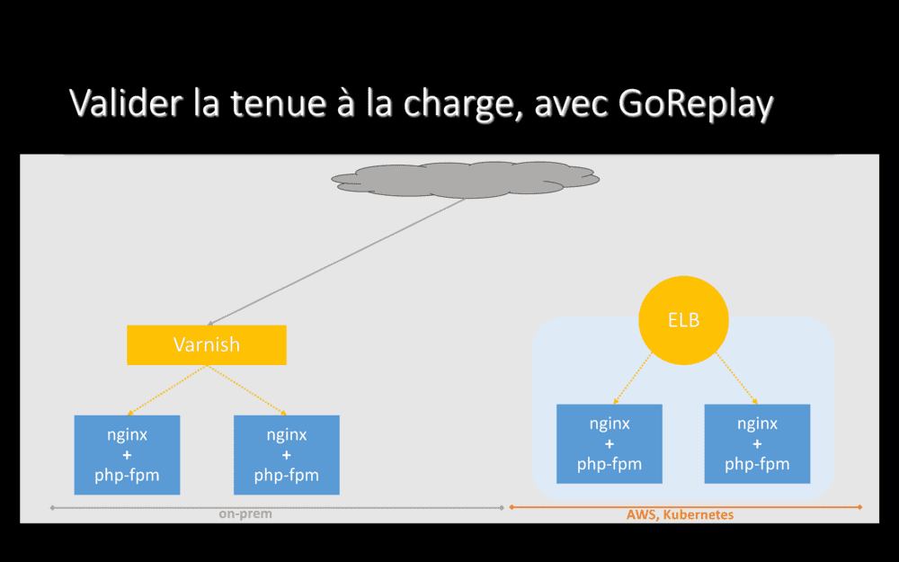

Les 23 et 24 mai, j'étais présent à [MixIT 2019](https://mixitconf.org/2019/), pour une présentation intitulée **« Migration de 6play vers Le Cloud, retour d’expérience »**. Puisque ma conférence n'a pas été enregistrée, voici une tentative de _transcript_, en espérant qu'il vous sera utile.

Vous trouverez en-dessous de chaque _slide_ le texte correspondant, éventuellement enrichi de quelques informations que je n'ai pas données lors de la présentation, puisque celle-ci ne durait que 50 minutes questions incluses. Le style est volontairement assez proche de l'oral.

Bonjour à toutes, bonjour à tous.

Je m'appelle Pascal MARTIN, je suis Lead DevOps chez M6 à Lyon. J'ai la chance d'être ici aujourd'hui pour parler de la migration de notre plateforme 6play vers _Le Cloud_.

_Imaginez_. Un beau jour, peut-être au début des soldes ou lors d'un événement exceptionnel : un **pic de trafic** sur votre application. Le nombre de requêtes s'envole ! Les CPU chauffent ! Les serveurs s'écroulent… L'application rame ou tombe. Vos utilisateurs ne sont pas satisfaits. Ils s'en vont. Ils partent chez votre concurrent. Vous avez déjà vécu cette situation ? Elle n'est pas agréable :-/

Pour répondre à ce pic de charge, vous avez besoin de plus de serveurs. Vous allez sur le site de votre fournisseur, vous passez du temps à choisir la machine qui répondra le mieux à vos besoins. Après tout, un serveur, ça coûte cher, vous allez l'acheter et l'amortir sur trois ans… Vous ne devez pas vous tromper. Vous obtenez un devis. **Une semaine est passée**.

Vous allez voir votre chef pour qu'il valide ce devis. Il a d'autres urgences à traiter. Il pose votre devis sur une pile sur son bureau. Après quelques jours, il revient enfin vers vous avec un "OK". Une **seconde semaine** est passée.

Vous retournez sur le site de votre fournisseur pour passer commande. Manque de chance, rupture de stock… Vu le temps qu'il faut pour valider un devis et puisque vous aviez soigneusement choisi la machine répondant au mieux à vos besoins, vous attendez quelques jours. Enfin, vous pouvez commander. Une **troisième semaine** s'est écoulée.

Le serveur est expédié. Manque de chance, grève des livreurs ou colis qui s'égare… Finalement, le carton arrive ! Une **quatrième semaine** vient de passer.

Un de vos collègues met le carton contenant le serveur dans le coffre de sa voiture, va jusqu'à votre datacentre, sort le serveur, l'installe, effectue les branchements électrique/réseau, installe l'OS, l'ajoute à votre hyperviseur de virtualisation… Une **cinquième semaine** s'est écoulée, mais, ça y est, enfin, vous avez un serveur de plus !

Cinq semaines pour ajouter de la capacité à votre hébergement ? J'exagère peut-être un peu… Mais pas tant que ça… Que s'est-il passé pendant ces cinq semaines pour les utilisateurs de votre application ? Ils ont été voir ailleurs. Combien de clients avez-vous perdu ? Et combien de chiffre d'affaire ?

Je travaille sur 6play : la plateforme de VOD et de Replay du groupe M6. Sur le Web, ça ressemble à ceci. Pour faire simple, notre plateforme héberge des vidéos et permet de les visualiser.

En 2017-2018, nous avons commencé à vendre notre plateforme, en marque blanche, dans plusieurs pays d'Europe. En Belgique (contenus différents, gestion éditiorale différente, même langue). En Hongrie (contenus différents, gestion éditoriale différente, langue différente -- ça a l'air simple, mais passer à plusieurs langues, ça a demandé un peu de boulot ^^).

On a continué, avec la Croatie. Là encore, contenus différents, gestion éditoriale différente et encore une autre langue.

Passer d'une plateforme qui diffuse des vidéos dans un seul pays à la même plateforme vendue en marque blanche dans trois autres pays européens, ça signifie plus de contenus à héberger et diffuser, plus d'utilisateurs à servir, plus de trafic sur l'ensemble de nos APIs et, donc, plus de charge !

Revenons-en au sujet de cette présentation : pourquoi et comment avons-nous migré cette plateforme dans _Le Cloud_ ?

Historiquement, notre plateforme était hébergée _on-prem_ : nous louions une salle dans un datacentre parisien. Dans cette salle, nous avions des serveurs, que nous avions achetés et que nous amortissions sur trois ans (d'où l'importance de choisir les bonnes machines). Nous avions aussi du matériel réseau pour les connecter. Et des frais supplémentaires, pour l'électricité, la climatisation ou le personnel qui allait racker un nouveau serveur ou changer un disque dur ou installer et configurer des serveurs et des services.

Le déploiement de notre projet à l'international a eu un bon impact sur notre hébergement. Nous stockons de l'ordre de deux tera-octets de vidéos supplémentaires, **tous les jours**. Vous imaginez racker deux disques dur chaque jour ? Vous allez vite déborder de votre salle serveurs ! Et je ne parle même pas des sauvegardes…

Au niveau du trafic et de la charge sur nos machines, nous avons en gros fait **fois deux**. Deux fois plus de requêtes sur nos APIs. Deux fois plus de consommation CPU.

Deux fois plus de consommation CPU, même si nous avions beaucoup de marge avant de vendre notre plateforme dans plusieurs pays, ça commençait à devenir difficile. Certains soirs, nous touchions la limite de capacité de nos machines !

Le graphe reproduit ici montre la consommation CPU de notre hyperviseur de production _on-prem_ : à droite, une soirée où nous sommes montés à **97% de CPU consommé**. Ça ne laisse pas beaucoup de marge !

Sur certaines applications, même, il nous est arrivé de plafonner à **100% de consommation CPU** pendant quelques dizaines de minutes. Pendant ce temps, vous vous en doutez, l'expérience utilisateur n'était pas au top :-(

Nous avons un pic de charge sur nos applications tous les soirs aux environs de 21h. Mais, en plus des variations de trafic tout au long de la journée, nous avons aussi une saisonnalité sur des périodes plus longues. Par exemple, pendant les deux mois de vacances d'été, la charge est assez basse. Dès la rentrée début septembre, à droite du graphe, elle remonte !

_on-prem_, nous payions pour tout l'espace sur ce graphe. Y compris pour l'espace en blanc, les serveurs allumés, qui consomment de l'électricité, mais qui ne font _rien_ pendant une bonne partie du temps :-/

Migrer vers _Le Cloud_, c'est une réponse à un besoin business. Nous avons plus de clients et plus de charge, nous souhaitons y répondre.

Nous voulons aussi que nos applications répondent bien en cas d'événements spéciaux, comme une émission qui rencontrerait plus de succès que prévu ou un match de football -- y compris lorsqu'il s'agit d'un match entre deux pays hébergés sur notre plateforme (comme un match France / Croatie, je crois que le screenshot à 100% de CPU pendant une petite heure vu un peu plus haut, c'était le soir de ce match).

Migrer vers _Le Cloud_, c'est pour nous un moyen de gagner en souplesse et en élasticité sur notre hébergement.

En partant dans _Le Cloud_, nous visons aussi à exploiter des services managés au maximum. Nous ne voulons plus installer, configurer et tenir MySQL à jour.

Nous utilisons des services managés pour _plein de choses_. S3 pour stocker des fichiers, RDS pour des bases de données relationnelles et DynamoDB pour du clé-valeur évolué. Elasticache/Redis pour du cache, Route 53 pour les DNS… Bref, plein de services managés. Et on a le choix : il y en a plus de 160 chez AWS.

Nous pilotons ces services managés avec Terraform et chaque projet gère son infrastructure, j'y reviendrai dans quelques minutes.

Notre plateforme est composée de plusieurs dizaines de services, plus ou moins "micro", principalement écrits en PHP. Nous souhaitons les packager et les déployer en isolation : quand je déploie une application A, cela ne doit pas avoir d'impact sur notre application B.

Nos déploiements doivent être reproductibles. Si des _pods_ de l'application B se lancent automatiquement à 21h pour répondre à un pic de charge, ils doivent exécuter la **même** version de l'application que celle que j'ai déployée à 15h. Des conteneurs Docker répondent bien à ces besoins.

Aussi, si nous exécutons `nginx` dans un conteneur et `php-fpm` dans un autre conteneur, nous restons sur des concepts familiers pour nos développeurs. Au lieu d'avoir des applications qui tournent dans des _serveurs_, elles tournent dans des _conteneurs_, mais ça ne change pas grand chose, fondamentalement.

Malgré tout, les conteneurs, _c'est pas si simple_…

Dès qu'on commence à travailler avec des conteneurs en production, on se retrouve face à des questions comme _"comment toujours avoir `nginx` (qui reçoit les requêtes HTTP) et `php-fpm` (qui effectue les traitements requis pour y répondre) qui tournent ? Et comment les faire communiquer l'un avec l'autre ?"_.

En allant un peu plus loin et en rapport avec nos besoins d'élasticité, une autre question que nous nous sommes posée est _"comment scaler le nombre de conteneurs `php-fpm`, en fonction de la charge, comme le soir lors de notre pic de 21h ? Automatiquement, bien sûr"_.

Et même, _"comment faire en sorte que `nginx` et `php-fpm` continuent à communiquer quand des instances de `php-fpm` peuvent apparaitre et disparaitre à n'importe quel instant ?"_.

La réponse à ces questions -- et à plein d'autres tout aussi complexes -- est d'exploiter un **orchestrateur de conteneurs**.

Celui que nous avons retenu est Kubernetes. Fin 2017, quand nous avons lancé notre projet de migration vers _Le Cloud_, Kubernetes semblait prendre la tête devant les nombreux autres orchestrateurs existant. Depuis, Kubernetes a très clairement gagné _la guerre des orchestrateurs_, au moins lorsqu'on travaille sur des plateformes de la taille de la nôtre.

Je disais tout à l'heure que nous utilisons au maximum des services managés. Le service Kubernetes managés d'AWS s'appelle EKS. Malheureusement, EKS n'était pas disponible à Paris lorsque nous avons commencé notre migration et nous avons donc créé nos clusters avec un programme nommé "`kops`". Nous re-testerons EKS prochainement et, si ce service répond à nos besoins, nous migrerons certainement en seconde moitié d'année, pour ne plus avoir à gérer le cluster nous-même. Encore une fois : gérer un cluster Kubernetes, ce n'est pas notre métier et nous avons d'autres façons d'apporter de la valeur à notre entreprise.

_Le Cloud_ va aussi, à terme, nous aider à augmenter la résilience de notre plateforme et de nos applications. Nous n'en sommes presque qu'au départ, mais si un serveur qui plante ou la consommation CPU qui atteint 95% ne sont plus des problèmes, nous y gagnerons en fiabilité. Kubernetes aide également, avec sa capacité à relancer ou scaler automatiquement une application.

  

J'anticipe certainement une question que vous m'auriez autrement posé à la fin de ce talk : _"et le serverless, alors, vous en faites ?"_

Quand on dit _serverless_, je pense à deux choses distinctes.

La première, celle à laquelle on fait le plus souvent référence, touche à l'exécution de code : les fonctions Lambda chez AWS. On ne gère pas de serveur ni de conteneur, on déploie du code et _Le Cloud_ se débrouille pour l'exécuter (bon, si c'était effectivement aussi magique…). Pour nous, cette approche est très bien adaptée lorsqu'il s'agit de réagir à des événements. Par exemple, une vidéo a été déposée sur un bucket S3 et il faut déclencher un workflow d'encodage -- nous passons d'ailleurs par une fonction Lambda dans ce cas. Par contre, les fonctions Lambdas nous semblent moins adaptées à du _temps réel_, comme une API HTTP. À cause de problématiques comme les cold-starts, par exemple. Mais aussi parce que le paradigme change, de même que la gestion des coûts ou le déploiement, la maintenance et les mises à jour.

La seconde, extrêmement pratique et que nous utilisons déjà largement, porte sur des services, où _serverless_ peut signifier ne pas avoir à gérer de dimensionnement. Par exemple, nous ne soucions pas de la capacité de stockage du service S3 : nous considérons qu'elle est _illimitée_. Ou nous ne réfléchissons pas à combien de CPU/RAM allouer pour DynamoDB. Ou nous avons remplacé RabbitMQ, qui saturait _on-prem_, par SQS, qui scale _à l'infini_.

Bref, ne pas gérer de serveurs -- ou, plutôt, leur dimensionnement -- c'est fort appréciable ;-). Nous nous reposerons probablement la question dans le futur sur les Lambdas, d'ailleurs.

  

OK. Donc, nous migrons vers _Le Cloud_, parce que nous avons besoin de souplesse et d'élasticité pour notre hébergement. Maintenant, voyons un peu comment on s'est organisé, quel planning nous avons suivi.

_Spoiler : ça prend énormément de temps !_

  

Pour commencer, une personne a passé en gros six mois à _faire de la R&D_ autour du _Cloud_ : tester des services managés chez différents fournisseurs, voir s'ils répondaient à nos besoins (performance, scalabilité, utilisabilité depuis PHP, coût…), découvrir Kubernetes et déployer quelques unes de nos applications, essayer de les casser et de les réparer…

J'étais cette personne, c'était du boulot, mais carrément fun ! Un gros investissement, je découvrais complétement Kubernetes, mais ça valait le coup et j'ai passé six mois super sympa ;-)

  

Après ça, nous avons décidé que nous allions faire quelque chose de _parfait_.

Notre infra chez AWS serait _parfaite_, notre cluster Kubernetes serait _parfait_, tout serait _parfaitement_ managé, le code décrivant notre infrastructure serait _parfait_, notre monitoring/logging/alerting aussi, de même que notre chaine de CI/CD qui serait elle aussi _parfaite_.

  

Après un à deux mois à une ou deux personnes, nous avons réalisé que nous n'arriverions _parfaitement_ pas à faire quelque chose de _parfait_. Nous ne connaissions pas encore suffisament l'écosystème, il bougeait de toute manière bien trop vite pour faire quelque chose de _parfait_.

Finalement, un soir autour d'une bière, un collègue et moi avons compris que, si nous voulions avancer… Il fallait avancer. Il fallait prendre une de nos applications déjà en production, la déployer dans _Le Cloud_ et voir ce qui allait casser. C'était peut-être un peu la bière qui parlait, mais sur le coup, c'était une idée de génie !

  

Bon, le lendemain matin, autour d'un café… Un peu plus compliqué. Forcément, des choses allaient casser : c'était le but ! Mais comment expliquer à nos collègues que nous allions prendre leur application qui marchait _parfaitement_ depuis des années, que nous allions la déployer dans _Le Cloud_ juste _pour voir ce qui allait foirer_ ? Sérieusement, on n'a même pas eu le courage d'essayer d'aller les voir ^^.

Donc, retour à la case réflexion. Est-ce qu'on ne pourrait pas déployer une application en production dans _Le Cloud_, pour apprendre ? Mais sans le faire _sauvagement_ ? Le faire en étant prudent, sans que les problèmes qui allaient certainement survenir n'aient d'impact perceptible par les utilisateurs ?

  

Commençons par monter notre infra de base chez AWS et y créer un cluster Kubernetes. Au passage, nos équipes (et pas seulement deux personnes) se familiariseront avec les nouvelles technos que ça met en jeu.

Ensuite, migrons un projet dans _Le Cloud_, mais avec une approche _sans risque_ -- nous verrons dans quelques minutes comment ;-). Voyons ce qui va casser, apprenons et fiabilisons.

Et ensuite, passons à d'autres projets -- tout en continuons à améliorer au quotidien.

  

Vous l'avez peut-être déjà compris, mais j'insiste : tout ça, migrer dans _Le Cloud_, ça prend du temps. Beaucoup de temps.

Déjà, il faut former et accompagner les équipes. Mes collègues ops ont dit, plusieurs fois, qu'ils ré-apprenaient leur métier. Mes collègues développeurs ont quant à eux découverts les principes d'_Infrastructure as Code_ et les _manifests_ Kubernetes.

Mais aussi, et là je parle plus en termes de délai, notre migration dans _Le Cloud_ s'est intégrée à notre travail quotidien : nous n'avons pas arrêté de développer nos applications et produits et nous avons donc dû intégrer, judicieusement, leur migration à notre backlog.

  

Bref, pour migrer dans _Le Cloud_, allons-y progressivement : construisons, mesurons ce qui fonctionne ou non, apprenons au passage… Et, au bout d'un moment, profitons de la souplesse que nous avons gagnée !

  

Maintenant qu'on a parlé un peu du temps que ça prenait et de notre planning, passons à la migration en elle-même. Comment avons-nous procédé pour migrer _sans risque_ ?

  

Tout d'abord, un projet de cet envergure, ça se fait grâce à _des gens_.

Nos ops bossent sur l'infrastructure _de base_, ce qui est commun à tous nos projets, comme les couches réseau ou la gestion des droits. Les développeurs adaptent leurs projets, par exemple pour utiliser SQS au lieu de RabbitMQ. Ils participent à l'écriture de leur infrastructure. Ensemble, les développeurs et sysadmins vont valider les performances de l'application sur son nouvel hébergement. Et tout au long du process, notre petite équipe DevOps accompagne les développeurs, notamment en s'installant en pair avec eux pour les aider à décrire leur infrastructure et à déployer leurs applications.

  

Justement, en parlant d'applications : je vous disais il y a quelques minutes que chaque projet gérait désormais son hébergement… Et bien, voici un de nos projets !

Si on s'était basé sur _les conventions_, on aurait placé un `Dockerfile` à la racine du projet, un `Jenkinsfile` à la racine du projet, un répertoire `charts/` à la racine du projet… Enfin, sérieusement, c'est pas déjà assez _la foire_ à la racine de vos projets ? Donc, on n'a pas fait comme ça.

Désormais, dans chacun de nos projets, nous avons un répertoire nommé `.cloud/`. Il s'appelle toujours ainsi, il est toujours stocké à la racine du projet et il contient toujours l'ensemble des fichiers décrivant l'infrastructure et le déploiement. Ça se traduit par, systématiquement, les quatre même sous-répertoires, pour les quatre étapes du déploiement d'un projet :

- La création de son infrastructure avec Terraform,
- La création de ses images Docker,
- Le déploiement vers Kubernetes via un Chart Helm,
- Et un pipeline Jenkins qui orchestre tout ceci.

Il y a quelques mois lors d'une autre conférence, nous avons appris que AirBnB suivait la même logique -- leur répertoire s'appellant `_infra`. _Les grands esprits se rencontrent_.

Sur la droite de l'écran, vous voyez le contenu du répertoire `.cloud/terraform/` pour ce projet. Il contient les fichiers qui décrivent l'infrastructure, à raison d'un fichier par service. Ces fichiers sont communs à tous nos environnements : développement, staging, production. Les seules différences entre ces environnement sont des valeurs (par exemple : tailles d'instances) et sont portées dans un fichier par environnement.

Autrement dit et j'insiste : le même code Terraform décrit nos infrastructures de développement, staging et production. Quand nous déployons en production, nous savons que _ça va marcher_, puisque nous avons déjà déployé la même infrastructure en staging, basée sur le même code. Et avant cela, nous l'avions déjà déployée en environnement de développement, où nous travaillons au quotidien !

  

Un fichier Terraform, ça ressemble à ça… Bref, du code en HCL et des variables. Je ne m'attarde pas plus que ça dessus, c'est pas super fun à lire. Par contre, c'est commité et ça passe en pull-requests et ça c'est top \o/.

  

Pareil pour nos manifests Kubernetes, ils sont commités, historisés, ils sont revus à chaque modification. Comme le code des applications.

Par exemple, ici, nous avons un auto-scaler qui fait varier le nombre de _pods_ d'une application de 4 à 50. Si nous voulons changer ces valeurs, la modification sera revue par nos collègues. Et c'est vraiment cool !

Autant les développeurs sont habitués à ce principe depuis des années, autant c'était encore un peu nouveau pour certains ops.

  

Ce screenshot date d'il y a plus d'un an : avant qu'on commence notre migration. Il montre le nombre de déploiements en production par jour : entre 20 et 30. Tous les jours de la semaine.

Depuis _toujours_, nos développeurs ont l'habitude de déployer ce qu'ils veulent, quand ils veulent. Une story n'est pas terminée tant que la fonctionnalité n'a pas été déployée. Jusqu'en production.

Pour nos déploiements _on-prem_, nous passions par _GoLive_ : une interface Web, développée en interne et jamais open-sourcée. Quelques clics et une application était déployée, dans n'importe quel environnement.

Hors de question de perdre cette souplesse en migrant dans _Le Cloud_. Hors de question que nos développeurs ne puissent plus déployer ce qu'ils veulent quand ils veulent !

  

_GoLive_ n'était pas adapté à des déploiements dans _Le Cloud_ et commençait à montrer son âge…

Nous avons cherché et essayé quelques solutions open-source pour déployer vers Kubernetes et autres, mais aucune ne nous a réellement séduit… Donc nous sommes restés sur un _bon vieux pipeline Jenkins_ qui lance des commandes bash. C'est moche, mais ça marche. On se reposera la question de l'outil de CI/CD dans la futur, certainement, mais au moins, on a pu avancer.

  

Maintenant, comment est-ce qu'on migre toute une plateforme ?

Et bien, on a commencé par une première application, la plus simple possible : une API sans dépendance, sans base de données, _stateless_, avec une seule route. Objectif : apprendre.

Ensuite, on est passé à des applications plus complexes, avec des dépendances ; y compris des applications dépendant de services managés.

Une fois qu'on aura fait tout ça (et c'est à peu près là où on en est de notre migration)… Il nous restera les backoffices et les API internes… Les trucs pas bien fun et pour lesquels l'élasticité du _Cloud_ ne servira pas tellement… Mais pour vider notre salle serveur _on-prem_, on n'a pas trop le choix.

  

En décembre 2017, alors que nous allions commencer notre migration, AWS a ouvert sa région Paris. Et cette région, c'est super pour nous ! otre datacentre _on-prem_ est en région parisienne… Et nous n'avons donc que 1.4 milliseconde de _ping_ entre nos deux hébergements !

Cela nous facilite énormément la vie : nous pouvons très bien avoir une application encore hébergée _on-prem_ qui effectue des appels d'API vers une second application déjà migrée chez AWS.

Ou, plus _moche_ mais extrêmement pratique, nous pouvons migrer une application dans _Le Cloud_ tout en conservant sa base de données _on-prem_, en effectuant des requêtes SQL cross-hébergement via un VPN. Ça marche très bien, nous l'avons fait pendant plusieurs jours/semaines, le temps de migrer progressivement certaines applications.

  

Pour migrer une application, plus en détails, comment faisons-nous ? Au départ, notre applications est hébergée _on-prem_, les requêtes effectuées par nos utilisateurs arrivent directement sur cet hébergement historique.

Ici, une application typique pour nous : plusieurs serveurs nginx+php, avec Varnish devant qui fait du load-balacing et du cache HTTP.

  

La première étape pour migrer cette application vers _Le Cloud_ est d'installer un proxy devant elle.

Nous utilisons HAProxy, logiciel open-source que nous exploitons depuis des années pour divers besoins et qui marche très bien, qui tient très bien la charge. Le trafic arrive d'Internet sur HAProxy, qui le transfère vers l'application. Nous avons ici juste ajouté un composant.

  

Ensuite, nous déployons notre application dans _Le Cloud_. Sans toucher à quoi que ce soit _on-prem_. L'ensemble du trafic qui arrive sur HAProxy continue d'être envoyé _on-prem_ et aucun utilisateur n'est donc servi depuis _Le Cloud_.

Par contre, nous, qui connaissons l'adresse directe du service déployé dans _Le Cloud_, pouvons l'interroger manuellement -- et, ainsi, valider que notre application a l'air de fonctionner.

  

Si l'application, déployée dans _Le Cloud_, a l'air de fonctionner pour nous… Passons à de vrais utilisateurs ! On y va prudemment : on reconfigure HAProxy pour envoyer 1% du trafic vers notre nouvel hébergement et conservons 99% du trafic _on-prem_.

Vu la charge qu'on prend sur nos services, avec 1% du trafic qui arrive sur notre nouvel hébergement, si un truc est mal configuré, on s'en rend généralement vite compte ;-).

  

Si tout a l'air de fonctionner avec 1% du trafic servi par _Le Cloud_, nous montons progressivement en puissance : 5%, 10%, 15%, 25%, 50%, 75%…

  

… Jusqu'à arriver à 100% du trafic servi depuis notre nouvel hébergement. Mais en ayant encore HAProxy devant. Et nous pouvons rester dans cette configuration pendant quelques jours (ou quelques semaines si besoin), le temps de valider que tout marche bien, y compris le soir pendant notre pic de trafic.

Pendant toute cette phase de bascule, si l'application cesse de fonctionner dans _Le Cloud_, si elle part en _timeout_ ou commence à retourner des erreurs 500, HAProxy rebascule automatiquement l'ensemble du trafic vers notre hébergement _on-prem_ (et, oui, nous avons testé et validé ce comportement avant de le mettre en place sur une vraie application).

Cela signifie que la bascule d'un hébergement à l'autre est progressive et quasiment sans risque : en cas de problème, HAProxy revient 100% _on-prem_, où l'application fonctionnait depuis des années.

  

Ici, on voit le trafic sur les deux hébergements d'une de nos application, le jour où nous avons commencé à le basculer dans _Le Cloud_ :

- Vers 10h, nous avons configuré le DNS pour pointer vers HAProxy. L'ensemble du trafic est alors envoyé _on-prem_, en orange.
- Vers 14h30, nous avons reconfiguré HAProxy pour envoyer 10% du trafic de l'application vers son nouvel hébergement dans _Le Cloud_, en vert.
- Ne constatant pas de problème, nous sommes montés à 50% une demi-heure après et les deux courbes oranges et vertes se chevauchant pendant un moment.
- Vers 16h30, tout avait l'air de bien se passer. Nous sommes toutefois revenus à seulement 10% du trafic dans _Le Cloud_, en prévision du pic de charge du soir et sommes restés dans cette configuration jusqu'au lendemain -- et tout s'est bien passé pendant la soirée et la nuit.

Sur les jours suivant, nous avons donc ré-envoyé 50% du trafic dans _Le Cloud_, puis sommes montés jusqu'à 99% et y sommes restés quelques temps.

J'ai menti quand j'ai parlé de "100%" un peu plus tôt. Nous avons plutôt l'habitude d'envoyer 99% du trafic dans _Le Cloud_ et de conserver 1% _on-prem_ pour garantir que les caches de l'application, _on-prem_, soient chauds. Ainsi, l'application n'a pas à repartir d'un cache froid en cas de re-bascule _on-prem_.

  

Quelques jours plus tard, nous avions 1% de trafic _on-prem_ (en orange) et 99% dans _Le Cloud_ (en vert). Sur ce graphe, on voit par moments la courbe orange remonter brusquement : notre application, ce jour là, partait parfois en erreur 500. Et HAProxy rebasculait l'ensemble de son trafic _on-prem_.

Encore une fois, donc : avec HAproxy branché devant nos applications, nous avons pu les migrer quasiment sans risque. Au pire, en cas d'erreur dans _Le Cloud_, HAProxy rebasculait automatiquement _on-prem_.

  

Quand nous avons validé que l'application fonctionnait bien sur son nouvel hébergement, y compris pour les services dont elle dépend, il ne nous reste plus qu'à faire pointer le DNS directement chez AWS et supprimer tout ce que nous avions _on-prem_, y compris HAProxy.

Félicitations, nous venons de migrer une première application \o/. Maintenant, il suffit de faire pareil pour toutes les autres ^^.

  

Migrer progressivement comme nous venons de le faire, c'est bien : ça permet de valider, au fur et à mesure, que notre nouvel hébergement tient la charge. Mais, pour une grosse application, ce n'est pas forcément optimal : avant de complétement s'écrouler, elle peut ralentir… Peut-être au point que nous utilisateurs en souffrent…

  

Dans certains cas, pour certaines applications, nous voulons valider la tenue à la charge avant de commencer à migrer. Sans risquer de causer des ralentissements qui impacteraient nos clients et utilisateurs. Nous ne l'avons fait que pour quatre ou cinq gros projets, parce que cela représente une charge de travail non-nulle, mais, pour ceux-ci, ça nous a vraiment beaucoup aidé.

Donc, comment on fait ? Repartons d'une application hébergée _on-prem_, avant de commencer à travailler sur sa migration avec HAProxy.

  

Le but étant de valider la tenue à la charge de l'application dans _Le Cloud_, dépoyons-là sur son nouvel hébergement -- sans lui envoyer de trafic réel.

  

Ensuite, _on-prem_, nous installons un logiciel nommé [Go Replay](https://goreplay.org/) -- le binaire s'appelle `gor`, donc j'utilise souvent ce nom.

  

Gor écoute le trafic qui passe sur le serveur ou il est installé (en gros, il fait un `tcpdump`) et rejoue l'ensemble de ce trafic _aileurs_. Ainsi, nous reproduisons dans _Le Cloud_ l'ensemble du trafic reçu par notre application _on-prem_.

Les réponses HTTP retournées aux utilisateur sont celles générées _on-prem_. Celles générées depuis _Le Cloud_ sont totalement ignorées. Mais cela nous permet de déterminer si l'hébergement dans _Le Cloud_ tient ou non la charge.

Là où nous avons été _fourbes_ sur certains projets, c'est que nous pouvons installer `gor` sur nos serveurs Varnish et lui faire écouter le trafic qui entre sur ces machines. Ainsi, nous capturons l'ensembles des requêtes entrantes, **avant** le cache HTTP, pour les rejouer sur AWS ! Si notre application avait un cache-ratio de 90% _on-prem_, nous allons envoyer **10 fois plus de trafic** dans _Le Cloud_ que ce qui arrive sur nos serveurs applicatifs _on-prem_ (puisque 90% des réponses, _on-prem_, sont directement renvoyées par Varnish). Et ça, ça fait un _sacré test de charge_ : si notre nouvel hébergement tient le coup quand on fait ça, nous savons qu'il répondra à nos besoins pour les prochains années. Et, encore une fois, nous avons obtenu cette information sans risque et sans impact pour nos utilisateurs.

  

En répliquant le trafic avec GoReplay (ou en montant progressivement en charge avec HAProxy), nous découvrons les adaptations requises pour tenir la charge.

Sous tous nos projets, cela signifie _fine-tuner_ les réservations / limites de CPU et de RAM au niveau Kubernetes, par exemple. Sur certains cas, nous avons atteint les limites de capacité de Redis, ou d'Elasticsearch. Ou alors, nous avons réalisé que nos instances de bases de données étaient clairement sur-dimensionnées.

C'est aussi l'occasion de travailler sur l'auto-scaling de nos applications. Pour certaines, scaler en fonction de la consommation CPU est suffisant. Pour d'autres, nous devrons peut-être scaler en fonction du nombre de requêtes, ou du nombre de messages dans une file de jobs.

Dans tous les cas, à nous de trouver le juste milieu entre répondre _parfaitement_ à la charge et limiter les coûts.

  

Jusqu'à présent, j'ai parlé de migrations. J'ai parlé de projets qui tournaient _on-prem_ et que nous avons migrés vers _Le Cloud_. Si je veux faire complet, je dois maintenant parler de projets pensés pour _Le Cloud_, de projets _Cloud Native_.

Tous nos nouveaux projets, depuis plus de six mois maintenant, sont dès le départ déployés dans _Le Cloud_ et n'ont jamais été déployés _on-prem_. J'aimerais en parler plus et vous raconter des _batailles épiques_, mais, en fait… Bah, ça se passe bien ^^.

  

Avant de finir, passons à un sujet à propos duquel j'ai toujours des questions… Et sur lequel nous avons en réalité à peine commencé à bosser. Un sujet qui pourrait mener à une conférence entière l'année prochaine : la gestion des coûts.

  

Chez AWS, c'est _simple_ : vous payez les serveurs en fonction du nombre de minutes (ou de secondes) pendant lesquelles ils sont allumés. Mais aussi, bien sûr, en fonction du type d'instance que vous exploitez -- qui conditionne la quantité de CPU et de RAM (et les performances disque et réseau) dont vous disposez. Ces instances ne coûtent pas le même prix dans toutes les régions, il peut être intéressant de faire tourner certaines applications aux US plutôt qu'en France. Vous payez aussi l'espace disque réservé. Ainsi que le réseau. Au moins le trafic sortant. Pas toujours le trafic entrant… Bref, je pourrais écrire une page entière sur le sujet -- d'ailleurs, je l'ai fait -- et ça ne serait pas fini ^^.

  

Version courte : c'est l'enfer ! **Tout se paye**.

Les instances, le réseau, le volume de trafic, les requêtes avec des prix différents en lecture et en écriture, les logs, les métriques… Tout. Même, des critères supplémentaires interviennent, comme la taille des messages ou la durabilité des données.

  

Pour s'en sortir, la première chose à faire est de **tout tagguer** : chaque ressource doit porter une information qui indique, au minimum, à quel projet elle est rattachée.

Par exemple, ici, on voit que le projet en _vert moche_ a un coût faible tous les jours… Sauf trois jours, sur la droite de l'écran. Trois jours qui ne se suivent même pas. Une telle variation de prix, sans savoir de quel projet il s'agit, ça serait difficile à comprendre. Là, il a suffit d'aller voir les développeurs du projet en leur demandant ce qu'il s'était passé ces trois jours (des imports de données en masse, en l'occurence).

  

Une fois que toutes les ressources sont tagguées, on peut zoomer sur les dépenses d'un projet.

Par exemple, ici, les coût de chacun des services AWS utilisés pour notre application de génération de miniatures d'images. On paye du CDN et du stockage, OK, normal. Mais un tier du coût du service qui correspond à de la base de données, c'est _étrange_ vu ce que fait cette application… En fouillant, effectivement, les instances de base de données étaient au maximum à 1.5% de CPU consommé, elles étaient nettement sur-dimensionnées et nous avons pu les redimensionner à la baisse pour payer moins cher.

  

Nous avons à peine commencé à travailler sur l'optimisation des coûts, mais j'ai déjà quelques exemples d'amélioration à vous partager ;-)

  

Ici, le coût par jour de notre cluster Kubernetes de staging. Au départ, nous n'utilisions que des instances _on-demand_. Des instances payées à la minute (ou seconde ?), mais qu'on paye plein tarif.

Mi-octobre, nous avons commence à utiliser des instances _spot_ pour tous nos worker nodes, en ne conservant des instances _on-demand_ que pour nos master nodes. Le résultat ? On le voit bien : des économies ! Les instances _spot_ peuvent coûter 60 ou 70% moins cher que des instances _on-demand_, c'est plutôt sympa !

  

Bien sûr, _pas de magie_.

Le côté _moins sympa_ des instances _spot_, c'est qu'AWS peut vous les _reprendre_. N'importe quand. Il nous est arrivé de perdre un tier de nos instances d'un coup. Au début, ça faisait mal… Depuis, on a retouché pas mal de configuration et notre cluster tient bien mieux à la perte d'autant de machines (du coup, notre plateforme a gagné en résilience.).

À vous de voir si perdre des instances n'importe quand est acceptable. Dans les faits, même si ça fait peur, c'est souvent jouable. Actuellement, en production, 20% de nos worker nodes sont des instances _spot_ et nous allons augmenter ce pourcentage dans les prochaines semaines.

  

Une autre option est de travailler avec des instances _réservées_.

Ici, un tableau de coûts d'instances `c5.4xlarge` à Paris -- les instances que nous utilisons comme worker nodes dans notre cluster Kubernetes de production. 16 CPU et 32 GB de RAM. Une instance de ce type, en tarification _on-demand_, coûte quasiment 7000 USD par an, si elle est allumée en permanence.

En s'engageant pour un an, nous pouvons réduire ce prix de plus de 30%. Hey, si nous savons qu'une instance sera allumée en permanence pendant un an, ça vaut le coup ! Nous avons réservé de la sorte nos trois master nodes, plus six worker nodes (nous ne descendons jamais en-dessous de six worker nodes). Ca fait tout de même plus de 10000 USD d'économies sur un an, en quelques clics !

  

Et si vous êtes sûr d'avoir besoin des mêmes instances pendant plus longtemps, vous engager pendant trois ans peut mener jusqu'à 58% de réduction -- si vous payez les trois ans en avance.

Bon, par contre, vous perdez _quelque peu_ en souplesse ; finalement, vous en revenez à acheter des machines et les amortir sur trois ans, comme vous faisiez _on-prem_. Mais dans _Le Cloud_.

  

Cela dit, si vous n'êtes pas sûr du type exact d'instance dont vous aurez besoin à l'avenir, vous pouvez aussi vous engagner, mais sur des instances convertibles -- vous pourrez changer de taille d'instances. Le gain est alors un peu plus faible. Mais c'est plus souple.

Alors, sur l'écran, combien de tarifs différents rien que pour un seul type d'instance ? Quand je disais, _l'enfer des coûts_. Bon courage !

  

Nous stockons de gros fichiers -- des vidéos -- sur S3. Un de nos buckets grossit d'environ 2 TB par jour. Cela représente un coût vraiment pas négligeable. Un moyen de réduire les coûts sur S3 est de changer de classe de stockage. Par exemple, en basculant les fichiers en _accès infréquent_, où le stockage coûte moins cher (mais où l'accès coûte plus cher).

Effectuer cette bascule _à la main_ demande de savoir précisément quels fichiers sont utilisés souvent ou non. Pas évident. Fin 2018, Amazon a sorti une fonctionnalité qui changement automatiquement la classe de stockage de fichiers, en fonction d'un apprentissage effectué sur 30 jours.

Sur le screenshot ci-dessus, on passe de violet à vert lorsque nous avons activé cette fonctionnalité sur ce bucket. 30 jours après, passage de vert à rouge, avec une réduction de 30% du coût de stockage : un très grand nombre de fichiers ont été passés en _accès infréquent_. **Une case à cocher, 30% d'économies**. Sur un bucket qui grossit de 2 TB par jour, ça vaut le coup !

  

Et puis, pour finir… Puisque tout a un coût dans _Le Cloud_, juste… _Ne faites pas n'importe quoi_ !

Ce screenshot, où je n'ai pas enlevé les montants sur l'axe à gauche, montre le coût par jours des écritures de logs vers Cloudwatch -- le service managé de logs d'AWS. Ici, on voit deux moments où nous avons payé _anormalement cher_.

Au départ, début février, nous payions environ 15 USD/jour, considérons que c'est _la normale_. Après quelques jours, nous avons un premier plateau, au milieu du graphe, entre 75 et 100 USD/jour. _Bizarre_. Nous avons fini par fouiller : qu'est-ce qui pouvait écrire autant de logs, pour que ça nous coûte aussi cher tous les jours ? Et bien, le 20 février, nous avons déployé une nouvelle application (exécutée plusieurs fois en parallèle) qui, dans ses logs, écrivait toutes les secondes "je suis vivante", "je suis vivante", "je suis vivante"… Toutes les secondes. Des dizaines de fois toutes les secondes, puisque nous avions beaucoup de replicas ! En supprimant ce log complètement inutile, en changeant un `-v=4` en `-v=2`, plus de 50 USD/jour d'économie !

Quelques jours plus tard, des pics à 100 USD/jour. Voire même 200 USD/jour. Whoa ! Le lendemain, c'était retombé, nous avons laissé filer sans chercher, nous avions autre chose à faire. Mais, quelques jours plus tard, à nouveau plus de 100 USD/jour. Juste pour écrire des logs. Bon, là, nous avons cherché. Et nous avons fini par réaliser qu'une application, écrite dans une techno dont je tairai le nom, plantait plusieurs dizaines/centaines/milliers de fois par secondes pendant notre pic de charge, en produisant à chaque fois une stack-trace longue _comme ça_ _(mouvement d'écarter les bras très large)_, chaque ligne se terminant par `.js` _(petite pause)_, qui était logguée vers Cloudwatch. _Ah oué_. Plus de 100 USD par jour, pour des stack-traces, que nous ne regardions même pas ? _Sérieusement_ ? Bon, on n'a pas cherché plus loin, on a fait disparaitre les logs de cette application en les redirigeant vers `/dev/null` et problème réglé. Malgré cette stack-trace, l'application fonctionne. Non, je ne sais pas l'expliquer.

Avec ces deux exemples, ce que je veux montrer, c'est que si vous faites _n'importe quoi_, vous allez le payer. Cher. Et faire _n'importe quoi_, ça arrive, il n'y a que ceux qui ne font rien qui ne se plantent jamais. Donc, suivez vos coûts, régulièrement !

  

Au niveau des bons côtés, tout tagguer permet de savoir exactement combien chaque projet coûte. Cela permet de facturer l'hébergement par projet, mais aussi de développer en fonction des coûts. De développer le business en fonction des coûts.

Par exemple, nous pouvons désormais aller discuter un product owner d'un projet qui coûte _une fortune_ mais qui ne rapporte _pas grand chose_ : peut-être qu'arrêter ce projet serait une bonne idée ? Ou, plus fréquemment, nous pouvons identifier qu'un projet extrêmement important pour le bon fonctionnement de notre plateforme est fort coûteux et décider d'investir du temps pour l'optimiser.

En plus de cela, les coûts ont désormais un impact sur nos choix techniques. En fonction des besoins d'un projet, ses développeurs vont choisir une base de données relationnelle avec RDS ou du clé-valeur évolué avec DynamoDB. Mais, désormais, le coût de ces solutions entre dans les critères de choix.

  

Dit comme ça, ça a presque l'air simple… Mais rappelez-vous ce que je disais il y a quelques minutes : _l'enfer des coûts_. En réalité, ce n'est pas exactement _simple_.

Au lieu de nous torturer l'esprit et d'essayer de deviner combien nous allons payer, nous avons admis que nous ne savons pas prédire exactement et nous suivons une approche plus pragmatique. Pour la migration de nos applications ou pour un nouveau projet, nous estimons _à la louche_ les coûts de nos choix techniques, nous développons, nous déployons… Et une fois l'application en production, nous suivons régulièrement son coût. Après quoi, nous optimisons et nous itérons. Et ce tant que le coût est _trop élevé_ ou tant que nous avons des idées d'optimisations pas trop coûteuses à mettre en place. N'oublions pas que le temps de développement, ça coûte cher aussi.

  

Au bout d'un moment, la question que tout le monde se pose : est-ce qu'un hébergement dans _Le Cloud_ coûte moins cher qu'un hébergement on-prem ?

Et bien, _ça dépend_. Si vos machines _on-prem_ étaient sous-utilisées et que vous faites quelques optimisations sur votre nouvel hébergement, peut-être. Si vos machines _on-prem_ étaient utilisées à 97% et que vous les aviez déjà amorties… Probablement pas tellement.

Cela dit, le coût des machines n'est pas le seul à prendre en compte. Et, selon vos besoins business, l'élasticité du _Cloud_ peut être un avantage certain, au-delà du coût.

  

Ca fait une grosse demi-heure que je parle de notre migration dans _Le Cloud_, de comment nous nous y sommes pris… Alors, au final, quel résultat ?

Et bien, **on a fait un truc qui marche** ! Ça nous a pris un moment, nous avons parfois eu du mal, je pourrais en parler pendant des heures… Mais ça marche et ça répond à nos besoins !

  

Tout d'abord, un gain que nous n'avions pas réellement anticipé, qui n'est pas la raison de notre migration, mais qui est évident quand on y pense après-coup.

Comme l'a noté Olivier, notre CTO adjoint, depuis que nos développeurs sont maitres de leur infrastructure, une des premières choses qu'ils font sur leurs projets, c'est les déployer. On ne lutte plus pour mettre en prod après trois mois de développement ! À la place, trois jours après la création d'un projet et alors que sa route de statut est fonctionnelle, il est déjà déployée en production -- éventuellement, _cachée_. À chaque fois qu'un nouveau développement est effectué, à chaque pull-request mergée, ça part immédiatement en production.

Donc, plus d'effet _"il faut déployer en production"_ après des mois d'efforts : la mise en production est non-événement.

  

Pour ce qui est de l'élasticité, qui était la raison principale de notre migration dans _Le Cloud_ : et bien, **objectif atteint** !

On voit ici le nombre de pods Kubernetes d'une de nos nombreuses applications. La nuit, en période de faible charge, une dizaine de pods tournent. Le soir, en plein pic de charge, des centaines. Et ça marche nickel, ça scale sans problème en fonction de la charge.

  

On retrouve cette élasticité au niveau des instances EC2, les machines de notre cluster Kubernetes, les machines que nous payons chez AWS : tout au long de la journée, pour répondre au trafic et à la charge, des machines se lancent ou sont éteintes.

Nous ne payons que pour les machines dont nous avons besoin, à tout instant. Et plus pour _"toutes les machines"_ toute la journée. En cas de pic de trafic, nous aurons plus de serveurs pendant quelques minutes ou heures, sans les payer plus longtemps.

  

En conclusion, donc ?

  

Migrer dans _Le Cloud_, pour nous, ça répond à une volonté, à un besoin. De l'entreprise.

Ça représente des centaines (milliers même) de jours de travail, qui impliquent tout le monde. Cela a donc un impact sur les produits et sur les roadmaps. Et n'est pas possible sans la volonté ni le soutien du management.

Au risque de me répêter : **migrer vers _Le Cloud_ n'est pas un projet technique** ! Migrer vers _Le Cloud_ est un **projet d'entreprise**, qui répond à un **besoin business**.

  

Quand vous lisez des articles sur Internet où quelqu'un vous explique très sérieusement qu'il a migré dans _Le Cloud_ en _cinq minutes_ et que son nouvel hébergement coûte _cinq dollars_ par mois… Heu. Ces gens essayent de vous en-fu-mer. Mais à fond.

Moi aussi, je peux déployer une application dans _Le Cloud_ en _cinq minutes_. En deux minutes et demie à trois minutes, même, montre en main. J'ai juste à cliquer dans Jenkins et à attendre un petit peu. Mais j'ai eu l'honnêteté de vous parler des mois, des nombreux mois, de travail qui ont précédé, pour mettre en place tout ce qui est en-dessous de ce simple bouton.

Pour la partie _cinq dollars_ par mois, j'ai plus de mal… Ça inclut les backups, le monitoring, le logging, l'alerting, l'outillage, l'écriture de l'infrastructure, la redondance, l'auto-scaling et les personnes qui savent gérer tout ça, vous croyez ?

  

Techniquement, migrer dans _Le Cloud_, pour nous…

Kubernetes, c'est un super outil. Riche, très riche. Mais aussi très complexe. Pour nous, qui avons une équipe de sysadmins, c'est un outil adapté. Pour une entreprise plus petite ou sans compétences ou personnes dédiées, ça se discute un peu plus, je pense.

Les services managés, c'est vraiment top. Ça nous fait autant de travail en moins. Au lieu de dépenser du temps gérer MySQL, nous pouvons nous concentrer sur ce qui compte : apporter de la valeur à nos collègues et à notre entreprise. L'_infrastructure as Code_, c'est génial. Pouvoir déployer la même infra dans plusieurs environnements, ne rien avoir de fait à la main sur des serveurs, ça change la vie.

Et surtout, il faut savoir avancer petit à petit, faire des compromis (même si c'est parfois difficile), améliorer et progresser. Faire _parfait_ du premier coup… Même plus en rêve :-D

  

Juste parce que c'était tellement _magique_ ce jour là, je ne peux pas m'empêcher de partager de graphique. Il s'agit du nombre de CPUs consommés par une de nos applications.

En début d'après-midi, cette application consommait 6 CPU. À 15h59, nous avons vidé son cache, d'un coup (nous avons changé de CDN)…

  

16 minutes après, l'application consommait 282 CPUs.

**En 16 minutes**, nous avons su **multiplier par 47 le nombre de CPUs** disponibles pour cette application.

_On-prem_, la plateforme se serait instantanément écroulée (nous avions déjà essayé une manipulation de ce type, je parle d'expérience). Dans _Le Cloud_ ? Et bien, nous avons suivi ce qu'il se passait avec grand intérêt… Et pris des screenshots ^^

  

Là où c'est vraiment _frappant_ c'est si on prend un peu de recul et qu'on regarde sur 24 heures… Vous vous souvenez, quand je disais qu'on avait un pic de trafic sur nos applications, tous les jours à 21h ? Vous le voyez le pic ?

  

Notre pic de 21h habituel, c'est _ça_. Cette _petite bosse_. L'application tient très bien ce pic de 21h tous les soirs. Elle a également très bien tenu la purge totale de son cache -- un événement plutôt exceptionnel !

**Merci _Le Cloud_ !**

  

Je suis certain que vous avez des questions, et ça tombe bien : je suis en train d'écrire [un livre nommé **Le Plan Copenhague**](https://leanpub.com/6cloud/), dans lequel je partage notre retour d'expérience de cette migration dans _Le Cloud_. En mode _"voila ce qui a foiré, et ce qui a foiré ailleurs, et comment on a amélioré, et comment on a progressé"_, un format qui manquait ailleurs, je trouve.

Si ça vous intéresse, et je pense que ça vous intéressera, j'ai déjà publié les 10 premiers chapitres. Il y en a déjà pour 220 pages. Ce livre s'appelle [**Le Plan Copenhague**](https://leanpub.com/6cloud/) et c'est disponible depuis déjà quelques mois, mis à jour au fur et à mesure de la publication des nouveaux chapitres.

 

Je m'appelle Pascal Martin, je suis Lead DevOps chez M6 à Lyon. J'espère que vous avez appris des choses pendant la petite heure que nous avons passée ensemble et je vous remercie pour votre attention !

 
