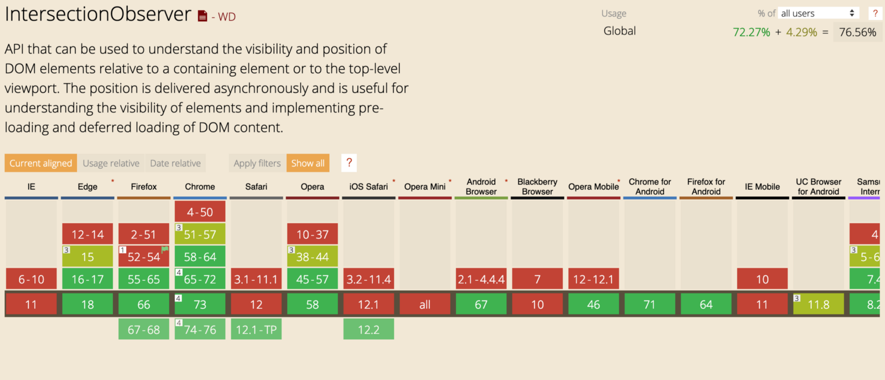

In the web world, we often have complex page structure.
All the parts are not visible in the user viewport at first.
Why should we load all the page content to be able to see it ?

By default, the browser load images in the lower part of you website, even if the user can't see them at first.
It could slow down the performance of your website.

**Every website audit tool will ask you to set up lazy loading on images. But how to do it with React ?**


## Example with a pictures grid

In order to show you how to do it with React, I bootstrapped a small app showing a grid of 1000 images.
I used styled-component as CSS in JS framework (CSS is JS is not required to lazy load images).

<iframe src="https://codesandbox.io/embed/m42qm215py?fontsize=14" title="Eager loading images" style="width:100%; height:500px; border:0; border-radius: 4px; overflow:hidden;" sandbox="allow-modals allow-forms allow-popups allow-scripts allow-same-origin"></iframe>

If you open a tab with your devtools opened, you will realize that:

- many HTTP queries has been made by your browser to fetch all the images.
- all broken images have no fallback in order to have a smoother feeling.

NB: loading 1000 images in a page is a very bad practice. It is just for the example here.

## Let's lazy load images

Let's create a dedicated component with an image placeholder.

```jsx
import React from "react"
import styled from "styled-components"

const Image = styled.img`
  display: block;
  height: 100px;
  width: 100px;
`

const placeHolder =
  "data:image/png;base64,iVBORw0KGgoAAAANSUhEUgAAAAEAAAABCAQAAAC1HAwCAAAAC0lEQVR42mNkqAcAAIUAgUW0RjgAAAAASUVORK5CYII="

export const LazyImage = () => {
  return <Image src={placeHolder} />
}
```

If you use this component instead of a simple `img` tag, you won't load image at all.
It will display the placeholder here encoded in `base64`.
This simple trick will let your browser show an image without generating an HTTP request because it is already _hardcoded_ in the source.

Base64 image source is just 1x1 pixel wide png. With that component, your browser won't load the real image. We need to tell him _when_ to do it.

### Intersection Observer for the win

Now let's try to trigger real image loading when the user really need it.
For that, we would need to have an API that let us know if an element is visible in user viewport.
That is exactly what [IntersectionObserver](https://developer.mozilla.org/fr/docs/Web/API/Intersection_Observer_API) provides us.



Intersection observer API provides us observe method to check on the visibility of an HTML element using its own ref.
In order to follow last React API, I used _Hooks_ to keep a simple functional component with state and lifecycle.

If you don't know what are Hooks or how to use them, take a look at my friend and colleague Matthieu Lux ([@Swiip](https://twitter.com/swiip?lang=fr)) with his [React Hooks : my introduction article](https://medium.zenika.com/react-hooks-my-introduction-81b15e6eff20).

I had to use `useState` to handle the `img ref` in order to correctly trigger my side effect only when the `ref` is correctly loaded.
Take a look at [this article](https://medium.com/@teh_builder/ref-objects-inside-useeffect-hooks-eb7c15198780) which explains why we can't use `useRef` with `useEffect`.

```jsx
import React, { useState, useEffect } from "react"
import styled from "styled-components"

const Image = styled.img`
  display: block;
  height: 100px;
  width: 100px;
`

const placeHolder =
  "data:image/png;base64,iVBORw0KGgoAAAANSUhEUgAAAAEAAAABCAQAAAC1HAwCAAAAC0lEQVR42mNkqAcAAIUAgUW0RjgAAAAASUVORK5CYII="

export const LazyImage = ({ src, alt }) => {
  const [imageSrc, setImageSrc] = useState(placeHolder)
  const [imageRef, setImageRef] = useState()

  useEffect(() => {
    let observer
    let didCancel = false

    if (imageRef && imageSrc === placeHolder) {
      if (IntersectionObserver) {
        observer = new IntersectionObserver(
          entries => {
            entries.forEach(entry => {
              // when image is visible in the viewport + rootMargin
              if (
                !didCancel &&
                (entry.intersectionRatio > 0 || entry.isIntersecting)
              ) {
                setImageSrc(src)
              }
            })
          },
          {
            threshold: 0.01,
            rootMargin: "75%",
          }
        )
        observer.observe(imageRef)
      } else {
        // Old browsers fallback
        setImageSrc(src)
      }
    }
    return () => {
      didCancel = true
      // on component unmount, we remove the listner
      if (observer && observer.unobserve) {
        observer.unobserve(imageRef)
      }
    }
  })

  return <Image ref={setImageRef} src={imageSrc} alt={alt} />
}
```

In this brand new implementation, I just made the component trigger image loading only when 1% of the image is visible in the viewport.

You can also note that if Intersection Observer is not available, it will trigger image loading.
As a consequence, some browsers won't be able to lazy load images.

You can also add margin on the viewport trigger, to make your browser load image if they are visible in the viewport + margin.

### Pimp it up with style

With that shiny LazyImage component, we are now able to let browser load image at will.
But we still not have a nice animation to display the loading to the user.

In order to make it smooth, I just had to handle `onLoad` and `onError` native event with custom CSS class to display image correctly.

This is the [LazyImage component](https://codesandbox.io/s/34vpxnno9p?fontsize=14) :

```jsx
import React, { useState, useEffect } from "react"
import styled from "styled-components"

const placeHolder =
  "data:image/png;base64,iVBORw0KGgoAAAANSUhEUgAAAAEAAAABCAQAAAC1HAwCAAAAC0lEQVR42mNkqAcAAIUAgUW0RjgAAAAASUVORK5CYII="

const Image = styled.img`
  display: block;
  height: 100px;
  width: 100px;
  // Add a smooth animation on loading
  @keyframes loaded {
    0% {
      opacity: 0.1;
    }
    100% {
      opacity: 1;
    }
  }
  // I use utilitary classes instead of props to avoid style regenerating
  &.loaded:not(.has-error) {
    animation: loaded 300ms ease-in-out;
  }
  &.has-error {
    // fallback to placeholder image on error
    content: url(${placeHolder});
  }
`

export const LazyImage = ({ src, alt }) => {
  const [imageSrc, setImageSrc] = useState(placeHolder)
  const [imageRef, setImageRef] = useState()

  const onLoad = event => {
    event.target.classList.add("loaded")
  }

  const onError = event => {
    event.target.classList.add("has-error")
  }

  useEffect(() => {
    let observer
    let didCancel = false

    if (imageRef && imageSrc !== src) {
      if (IntersectionObserver) {
        observer = new IntersectionObserver(
          entries => {
            entries.forEach(entry => {
              if (
                !didCancel &&
                (entry.intersectionRatio > 0 || entry.isIntersecting)
              ) {
                setImageSrc(src)
                observer.unobserve(imageRef)
              }
            })
          },
          {
            threshold: 0.01,
            rootMargin: "75%",
          }
        )
        observer.observe(imageRef)
      } else {
        // Old browsers fallback
        setImageSrc(src)
      }
    }
    return () => {
      didCancel = true
      // on component cleanup, we remove the listner
      if (observer && observer.unobserve) {
        observer.unobserve(imageRef)
      }
    }
  }, [src, imageSrc, imageRef])
  return (
    <Image
      ref={setImageRef}
      src={imageSrc}
      alt={alt}
      onLoad={onLoad}
      onError={onError}
    />
  )
}
```

<iframe src="https://codesandbox.io/embed/34vpxnno9p?fontsize=14" title="Lazy loading" style="width:100%; height:500px; border:0; border-radius: 4px; overflow:hidden;" sandbox="allow-modals allow-forms allow-popups allow-scripts allow-same-origin"></iframe>

## Going further

Lazy loading is key to make an awesome user experience.
This article is only focused on images loading. However, with React you can lazy load more than just images.
Thanks to `React.lazy` and `React.Suspense` feature, you could also lazy load components and related code.

In the upcoming version of React (currently in 16.8.5), we will be able to use _createFetcher_ (a still work in progress feature) to let us control lazy loading and fallback of _asynchronous rendered components_.
If you are curious, take a look at this conference about the upcoming features.

<iframe width="560" height="315" src="https://www.youtube-nocookie.com/embed/nLF0n9SACd4?controls=0" frameborder="0" allow="accelerometer; autoplay; encrypted-media; gyroscope; picture-in-picture" allowfullscreen></iframe>

<Author />
<LastTenPosts />
