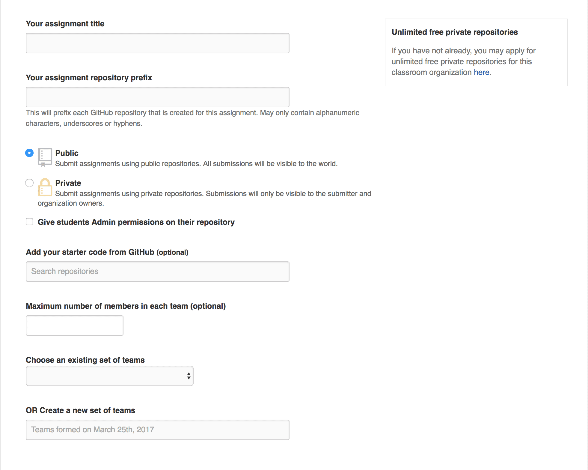

**Lorsque j'ai commencé à enseigner en septembre dernier, je recherchais une solution
pour pouvoir suivre facilement l'avancée des étudiants pendant leur TP. J'ai d'abord songé à leur
demander l'accès à leur repository Github/Bitbucket... mais je me suis vite rendu compte que ça
n'allait pas être gérable durablement. J'ai alors cherché une solution clé en main.**

Je suis alors tombé au hasard de mes recherches sur le forum de la [communauté des
enseignants sur Github](https://education.github.community). Une communauté très active et dont le sujet
principal de discussion est **Github classroom**. J'ai alors décortiqué cette solution proposée par Github
afin de la tester au plus vite avec mes étudiants.

# Constat, en TP on est très mal équipé

Avant de vous décrire le fonctionnement et la mise en place de cet outil avec vos étudiants,
je préfère faire une petite liste des problèmes que j'ai pu rencontrer en tant que professeur
ou même en tant qu'étudiant lors de la réalisation d'un TP.

- **Démarrer votre TP en 5 minutes avec vos étudiants, impossible.**
  Il est clair que passer une clé usb de PC en PC pour distribuer soit les sources du TP soit
  le sujet ce n'est pas pratique. On observe facilement que certains étudiants
  ne commencent alors leur TP qu'au bout de 15/20 minutes.

- **Difficile de suivre l'avancement des étudiants.**
  Il arrive que des étudiants souhaitent avoir de l'aide pour résoudre un problème
  avec leur projet. Sans outils, on est souvent obligé de faire de nombreux échanges par
  mail pour finir par se comprendre et réussir à apporter son aide. Se contextualiser
  en lisant un mail où l'élève lâche juste un _ça marche pooo !_, c'est pas très facile.

- **Le rapport, le code du projet, les mails d'échanges avec les étudiants, à des endroits différents.**
  Le rendu du TP, il faut l'avouer c'est vraiment l'étape la plus énervante.
  Entre les étudiants qui oublient la moitié des choses à rendre, les retards,
  les outils de la faculté qui ne marchent pas, centraliser et noter les travaux pratiques des étudiants
  devient vite un véritable calvaire que l'on traine sur plusieurs jours.

- **_"Non Monsieur j'ai pas copié" :_**
  Trop de fois les étudiants se Ctrl-C/Ctrl-V les TPs et cela peut être
  très compliqué de vérifier qu'un étudiant n'a pas juste recopié le code de son collègue.

* **_"Et toi t'as fait quoi sur ce TP ?"_**
  Et oui, parfois, quand les étudiants sont en groupe, un fainéant peut se cacher au milieu.
  Il est donc difficile d'évaluer réellement la compréhension individuelle dans cette situation.

* **Comment vérifier que leur TP marche ? Dois-je l'installer ?**
  40 élèves, TP par binôme, cela fait 20 TP à installer et à vérifier. Il arrive que l'élève ait
  configuré son projet un peu bizarrement et il vous faudra au moins 10 minutes pour comprendre
  ce qu'il a fait.

# Préparer un TP avec Github Classroom

Alors déjà pour être clair, utiliser un outil comme **Github Classroom** nécessite du temps
de préparation supplémentaire. Il y a tout un tas de choses à configurer avant la première séance
avec ses élèves. Cependant, ce temps de préparation va être largement récupéré dès que le TP aura commencé.

## Un outil bien expliqué

Cet outil a une prise en main assez évidente, mais Github nous a quand même fourni
plusieurs vidéos explicatives qui suffisent à comprendre son utilisation.

<blockquote>

Getting started

<iframe src="https://www.youtube.com/embed/ChA_zph7aao?ecver=2" width="640" height="360" frameborder="0" style="position:absolute;width:100%;height:100%;left:0" allowfullscreen></iframe>

</blockquote>

<blockquote>

How to set up group assignments

<iframe src="https://www.youtube.com/embed/-52quDR2QSc?ecver=2" width="640" height="360" frameborder="0" style="position:absolute;width:100%;height:100%;left:0" allowfullscreen></iframe>

</blockquote>

## Les contraintes

Cet outil n'est pas magique, il impose quelques contraintes qui peuvent être
bloquantes pour vous et vos étudiants.

- Il vous faut un compte Github
- Tous les élèves doivent avoir un compte Github, il peut être difficile d'imposer ça aux élèves
- Vous devez maitriser Git et bien connaitre l'interface de Github.
- Vos élèves doivent être autonomes avec Git.
- Vous devez créer une organisation sur Github (en quelques clics)
- Les sources des TP et les réalisations de vos étudiants seront publiques si [vous
  ne demandez pas une organisation privée à Github pour votre école.](https://education.github.com/discount_requests/new)

## Les étapes à respecter

### 1. Préparer vos sources et votre énoncé

Il vous faudra tout d'abord déposer vos sources sur un dépot Github en
veillant à bien le nommer pour le retrouver par la suite. Il faut aussi veiller à ne pas
_marquer_ vos TP par les fichiers de configuration de votre IDE. En effet,
vos étudiants n'utiliseront pas forcément le même que vous et ces fichiers pourraient les gêner/les troubler
_(il en faut peu)_

Je vous conseille également de rédiger l'énoncé en [Markdown](https://guides.github.com/features/mastering-markdown/)
directement dans le fichier `README.md` .

Enfin, histoire de tout centraliser au même endroit, je vous pousse à
définir un fichier `Rapport.md` pour que les étudiants rédigent également leur rapport en Markdown.
(Après un premier test, les étudiants ont bien apprécié le Markdown. Très simple à comprendre, il leur a
permis d'insérer du code mais également des images dans leur rapport sans prêter attention à la mise en page)

Pour terminer, [voici un exemple de TP que j'ai configuré pour mes étudiants.](https://github.com/PolytechLyon/isi3-tp1-graph)

### 2. Configurer votre _assignement_

Une fois votre TP déposé sur un dépôt Github, il ne vous reste plus qu'à définir une `instance`
de TP depuis l'interface de Github Classroom.

Quelques petites astuces pour créer vos _assignements_ :

- Bien préciser les classes, groupes, année dans le titre.
- Indiquer votre starter code de l'étape 1.
- Vous pouvez bloquer le nombre maximum d'élèves par groupe.
- Vous pouvez reprendre les équipes entre les différents TP d'une même matière.

### 3. Diffuser votre TP à vos élèves

Cette étape vous fera gagner un temps précieux, en effet, une fois votre _assignement_ créé
l'outil vous génère un lien qui permettra aux étudiants de s'y connecter et de se regrouper.

Dans le cas des TP en groupe, un étudiant doit s'y connecter et créer son équipe, les autres pourront
ensuite la rejoindre.

Un _repository_ sera alors créé par équipe.

### 4. Suivre vos élèves dans leurs développements

Vos étudiants vont un peu vous prendre pour la NSA, mais rassurez-les c'est pour leur bien.
Une fois les dépots créés, vous pourrez voir sur votre page d'accueil github tous les commits
de vos étudiants. Cela vous permettra de faire de la _review_ au fil de l'eau si vous avez le temps.

Vous pouvez également voir avec eux pour qu'ils ouvrent une _issue_ s'ils ont besoin de votre aide.
Dans cette situation vous serez notifié par mail. L'étudiant pourra même vous indiquer dans l'_issue_
le code qui lui pose problème.

### 5. Évaluer leurs réalisations

Pour l'évaluation vous avez deux solutions :

- Inspecter leur _repository_ et lire leur code. Pour cela je ne peux que vous conseiller
  l'extension [Octotree](https://chrome.google.com/webstore/detail/octotree/bkhaagjahfmjljalopjnoealnfndnagc)
  qui vous permet d'afficher l'arbre des fichiers du dépôt.
- Mettre en place des tests unitaires sur le projet de base et connecter un outil de CI en SaaS comme travis-ci.

<Author />
<LastTenPosts />
