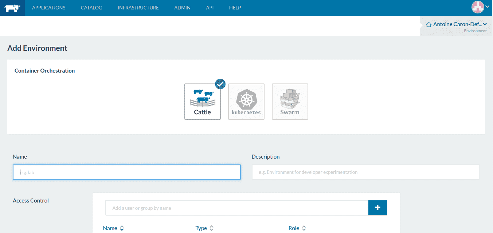
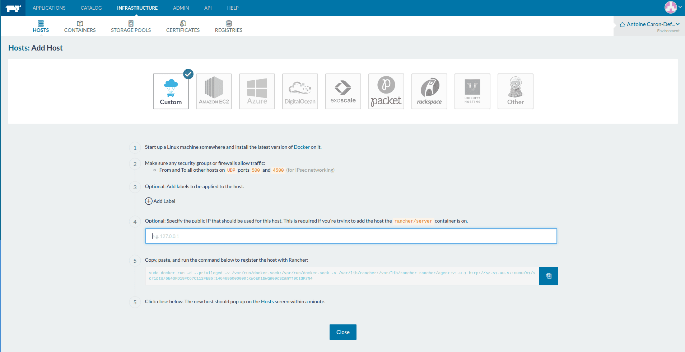
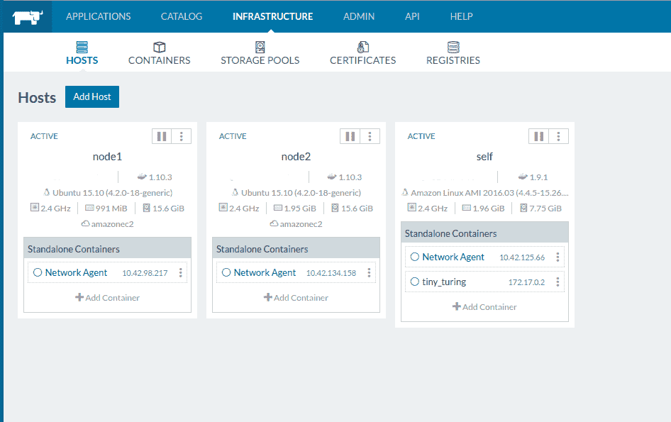
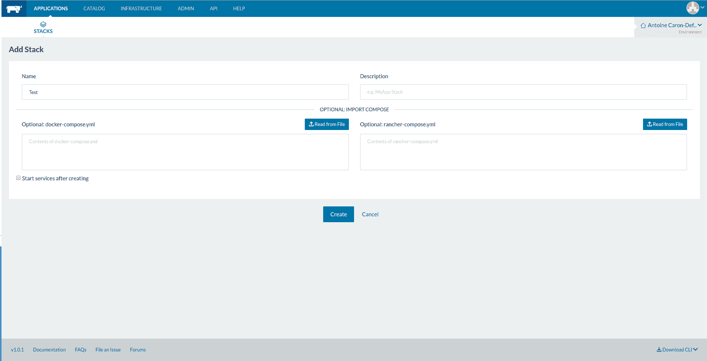
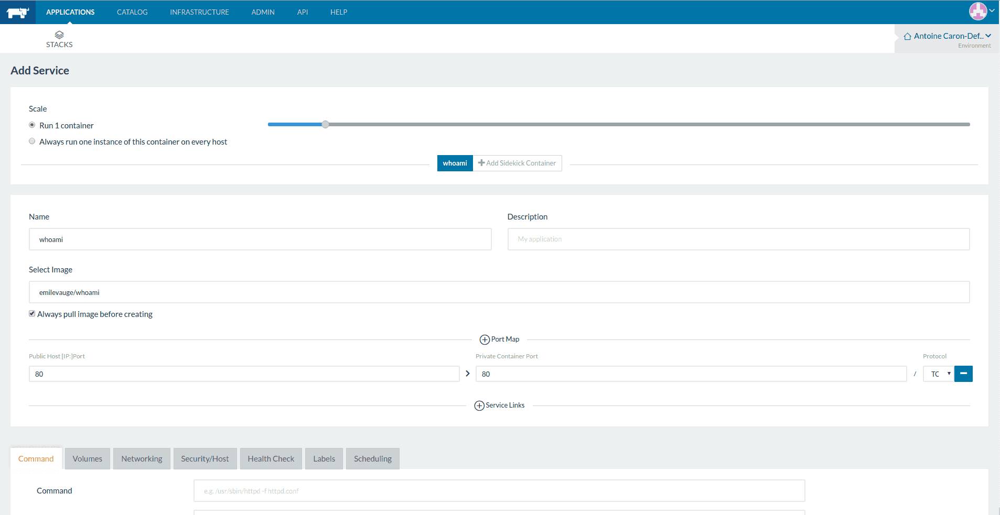
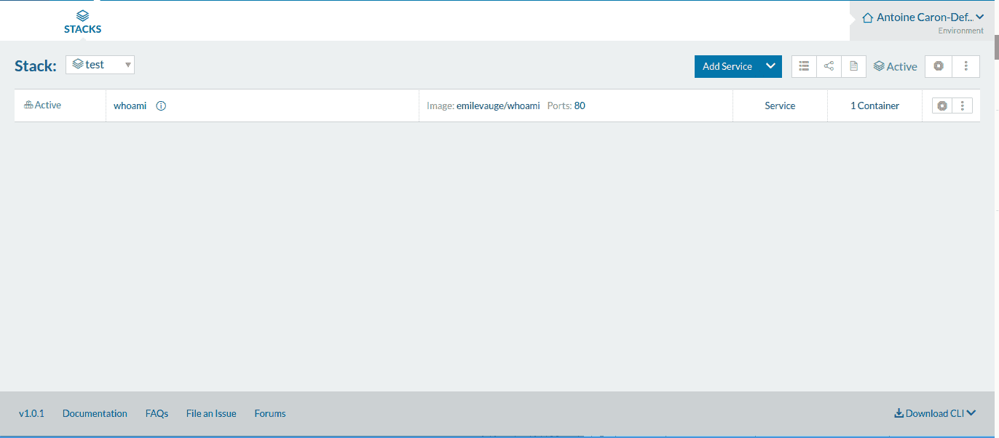
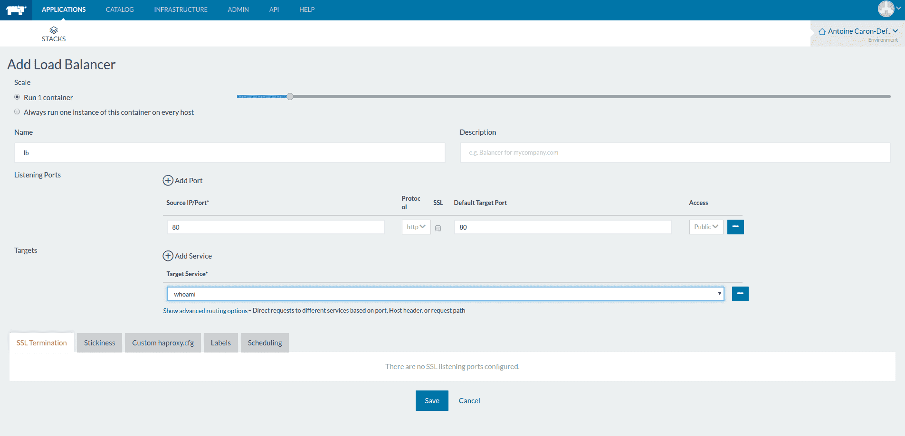
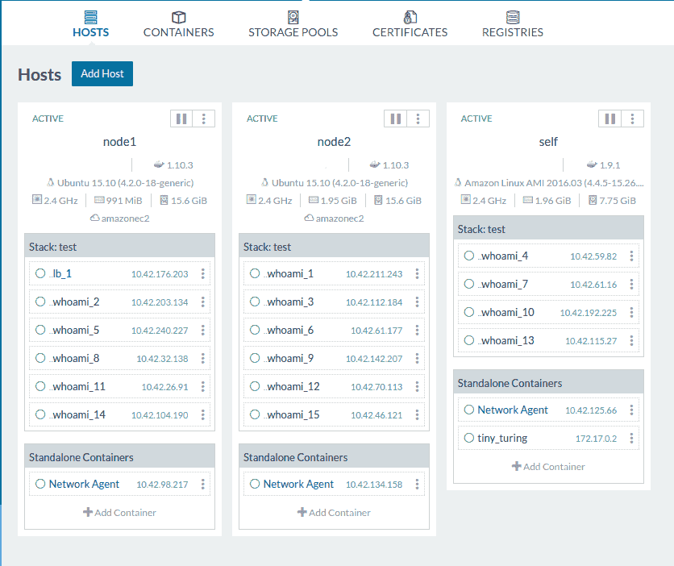
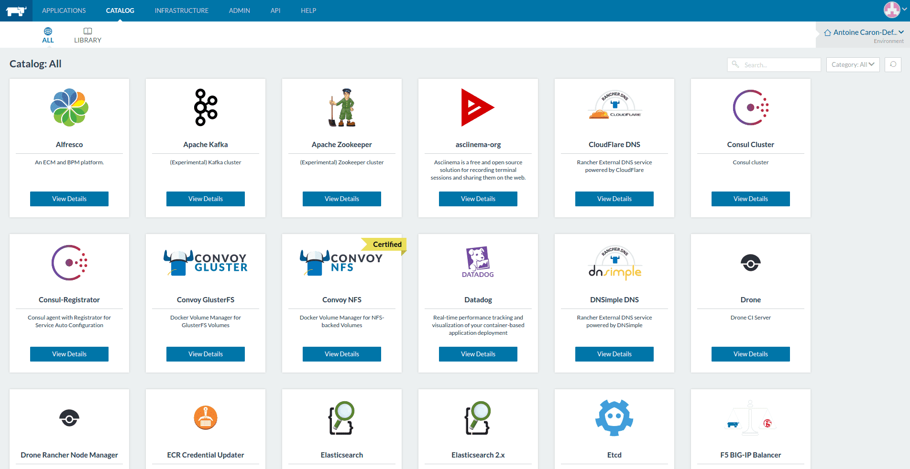

Mon expérience en tant que stagiaire chez Zenika m’a amené à utiliser
Rancher pour orchestrer mes conteneurs Docker. Je vous présente ici un
condensé de mon expérience avec cet outil, de son intérêt et de ses
points forts, par le biais d’un petit “How to“ sur comment déployer son
application ?

On constate que de plus en plus d’utilisateurs Docker cherchent à
manipuler plus facilement leurs conteneurs et à mettre en place du
déploiement continu. L’environnement technique autour de la
problématique d’orchestration des modèles CaaS (Container as a Service)
est très large et il est parfois difficile de s’y retrouver.

## Qu’en est-t-il de Rancher ?

### Késako

Rancher, projet open-source créé par la société Rancher Labs est un
outil gratuit d’orchestration de conteneurs Docker. Il permet de
facilement déployer des conteneurs Docker sur des machines possédant
Docker. Grâce à une configuration simple et complète, il permet de lier
ses conteneurs afin de composer des architectures de services aisément.
Il peut déployer des containeurs sur des services cloud comme AWS,
Azure, DigitalOcean mais aussi sur des machines personnalisées
possédant Docker tout en s’appuyant sur docker-machine.

### Une installation assez simple

Pour installer Rancher, à ce jour il suffit de posséder une machine
linux 64-bit avec au moins 1GB de mémoire vive.

```bash
$ sudo docker run -d --restart=always -p 8080:8080 rancher/server
```

Après quelques minutes d’installation, le server Rancher est disponible
sur le port 8080 de votre machine (l’image contient une base MySQL, un
Zookeeper, Redis, et le serveur rancher). Vous pouvez vous y connecter
car l’accès est par défaut ouvert à tous. Par la suite, vous pourrez
activer l’authentification,et ainsi facilement configurer des comptes
pour vos utilisateurs.



### Déployer une application simple avec Rancher

Après l’IaaS, le SaaS, le PaaS, le DaaS et Patricia Kaas, voila
maintenant venue l’ère du Caas (Container as a Service). L’objectif
ici est de conteneuriser les services de son(ses) application(s) et de
les faire interagir. Pour montrer simplement la mécanique de Rancher,
j’ai choisi de vous présenter le déploiement d’une application web très
simple nommée whoami, disponible sur le Docker Hub (développé en Go
par Emile Vauge).

Pour ce faire, je vais vous expliquer la méthode de création de
services par l’interface graphique. Sachez que l’on peut interagir
avec Rancher par l’intermédiaire d’un outil en ligne de commande
(rancher-cli,encore très limité pour l’instant) ou d’API REST.

#### Ajouter des hosts sur lesquels déployer

Dans un premier temps il faut définir des machines sur lesquelles
déployer votre application.



Rancher propose des connecteurs à plusieurs services cloud du web comme
Amazon EC2, Azure, Digital Ocean, mais vous pouvez également ajouter
n’importe quelle machine disposant de docker comme “host” Rancher
(“Custom”).

Pour l’exemple, j’ai ajouté deux machines au cluster nommées node1 et
node2, et j’ai ajouté l’hôte Rancher lui-même self
(c’est possible mais non recommandé).



#### Créer son service

Il faut maintenant créer une stack pour accueillir notre service whoami.
Dans la logique Rancher, une stack est un ensemble de services.



On peut remarquer que pour l’ajout d’une stack, on peut importer un
fichier `docker-compose.yml` et un fichier `rancher-compose.yml`.

Le fichier docker-compose.yml définit la structure de la stack,
l’ensemble de ses services ainsi que leurs configurations.
Ce fichier est natif de l’api Docker Compose.`

Le fichier rancher-compose est un “add-on” au docker compose,
il permet de configurer des paramètres Rancher comme la configuration
des loadbalancer (HA-Proxy) et la scalabilité horizontale des services.
Ces deux fichiers sont exportables à tout moment, cela peut-être très
pratique pour une réinstallation (par exemple, voici la
[configuration de la stack](https://drive.google.com/file/d/0B0NhGeba-vjZVnJldGRYUTBZaGs/view)
qui est installée dans cette partie).

Une fois la stack créée en lui donnant uniquement un nom, il faut
ajouter notre service whoami. Pour cela il suffit de cliquer sur
“Add service” et de le définir comme cela.



On remarque que seul le nom du service, l’image docker et le “port map”
ont été définis (ie: c’est un exemple simple, vous pouvez voir par les
onglets du bas que la configuration peut être beaucoup plus poussée,
gestion des volumes, du network du service, des HealthCheck).

Après cette simple configuration, il suffira de cliquer sur “Create” et
informagiquement votre service sera déployé sur un host choisi par Cattle.

Vous allez me dire, “qu’est ce que Cattle ?”, et vous aurez raison.
Cattle est l’orchestrateur par défaut utilisé par Rancher. Il est
maintenu par l’équipe de Rancher et le projet est open-source et
disponible sur Github.

Sachez que Rancher fonctionne également avec Kubernetes, Swarm et
Mesos mais pour cet article, je me suis limité à l’utilisation de Cattle.

#### Scaler et Loadbalancer

Après quelques temps de démarrage, votre service whoami devrait être
disponible.



Si vous cliquez sur le “80”, vous devez accéder au service whoami.
Il vous donnera plusieurs informations sur lui-même, notamment son nom.

Le but maintenant est de scaler notre service, afin de le distribuer
sur plusieurs machines.

Dans le détail du service, on peut voir que la scale est actuellement
définie à 1. Il suffirait donc de l’augmenter ? Et bien non, le service
que nous venons de définir occupe le port 80 de la machine. Il ne
pourrait donc pas être disponible plus d’une fois par machine. Et c’est
là l’une des problématiques des microservices : l’allocation dynamique
de port et la “connaissance” des services par le loadbalancer. Rancher
offre une solution simple à ce problème, il ne faut plus réserver de
port pour son application, le loadbalancer va connaître les services
par l’orchestrateur.

Il faut donc supprimer la configuration du port statique du service.

Une fois le port libéré , il faut donc créer un loadbalancer qui
distribue la charge entre les instances de whoami. Dans la stack,
cliquez sur “Add Load Balancer”



Une fois le loadbalancer créé, on peut donc augmenter la scale de son
application sans avoir de problème d’allocation de port. Si vous cliquez
le “80” du loadbalancer, vous devez atteindre votre service, et s’il
est scalé, l’hostname devrait changer au refresh.

A ce stade du déploiement, on peut se demander, ce qu’il en est de
l’infrastructure des machines créées plus tôt.



Rancher a déployé les conteneurs docker de façon équilibrée entre les
différentes machines. On peut définir nos propres règles de déploiement
par l’utilisation de label sur les machines.

Par exemple, on peut ajouter le label “name = frontend”, et pour chaque
service que l’on crée, définir si il peut démarrer ou non sur la machine
dont le name est frontend.

Sur chacun des conteneurs, rancher nous permet d’accéder à un shell et
une vue des logs, ce qui est très pratique pour le débug.

Certes cet exemple était simple, mais on peut facilement déployer des
architectures plus complexes grâce à Rancher, et c’est là tout son
intérêt. Voici l’architecture des services de l’un des projets que j’ai
déployé grâce à lui.


### Un « blue/green deployement » et une “rolling upgrade” en 5 minutes

Dans la plupart des cas, une mise en production est souvent un
passage difficile pour le développeur. Les outils DevOps ont bien
évidemment permis de simplifier cette étape cruciale de la vie d’un
projet.

Rancher permet d’utiliser plusieurs méthodes pour mettre à jour un
service déjà en production tout en garantissant la continuité des
services :

#### La rolling upgrade (remplacement d’un service par un autre)


#### Le blue/green deployement

Ces deux méthodes ont été présentées par Christophe Furmaniak et
Youcef Yekhlef (deux consultants architectes de Zenika) lors de leur
intervention à de pendant la Devoxx 2016. Je ne peux que vous
conseiller de la regarder :

<div style="position:relative;height:0;padding-bottom:56.25%">
<iframe src="https://www.youtube.com/embed/QFqt8xMTChY?ecver=2" width="640" height="360" frameborder="0" style="position:absolute;width:100%;height:100%;left:0" allowfullscreen></iframe>
</div>

### Un service DNS et Network overlay

Pour ceux qui ont déjà bien pratiqué Docker, faire communiquer deux
containeurs entre eux sans avoir d’outil d’orchestration n’est pas très
aisé. Bien sûr, il y a la publication de port sur le Host, mais on
arrive vite aux limites. Rancher apporte nativement une fonctionnalité
d’overlay network via un tunnel ipsec permettant à deux containers sur
deux machines différentes d’être sur le même réseau virtuel. Rancher va
plus loin puisqu’il possède son service DNS dans lequel il enregistre
chaque nouveau container qu’il crée. Cela a plusieurs avantages:

- Deux services d’une même Stack se connaissent par leur nom ;
- Un service peut connaître un service d’une autre stack par `nomService.nomStack`.

### Un catalogue qui s’enrichit



Rancher possède son propre catalogue d’applications, ces applications
sont sous la forme de groupes de stacks pré-configurées qui s’appuient
sur les images du Docker Hub :

- La stack Elastic ;
- Janitor, un service basé sur docker-cleanup, pour nettoyer les images et conteneurs non-utilisés. ;
- Traefik, un load balancer développé en Go par Emile Vauge de la Zstartup Containous ;
- Gluster, un gestionnaire de volume partagé ;
- Odoo, le célèbre ERP open source ;
- etc.

Il est aussi possible d’ajouter son propre
[catalogue de stacks d’entreprise](http://docs.rancher.com/rancher/v1.5/en/catalog/)

Je vous ai présenté ici les principales features de Rancher,
je ne peux que vous conseiller de le tester pour faire joujou avec vos
conteneurs Docker. Cependant, la question qu’on peut encore se poser
aujourd’hui reste la suivante : Rancher ne restera-t-il qu’un joujou
pour orchestrer des services ? On sait déjà que des entreprises comme
Orange et Sony commencent à l’utiliser pour des besoins interne
(cf : Sony et le playstation Network https://www.youtube.com/watch?v=hwhxXwT6zlw)

N’hésitez surtout pas à partager vos expériences avec Rancher.

Merci encore à Youcef Yekhlef, Christophe Furmaniak et à mon tuteur de
stage Christophe Tardella pour l’aide apportée à la rédaction de cet article.
