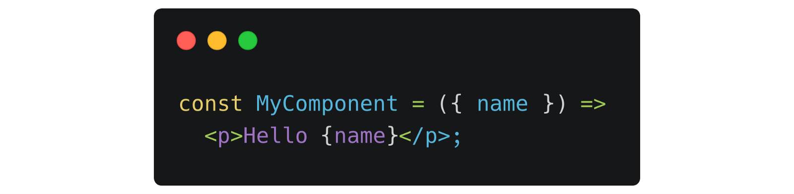
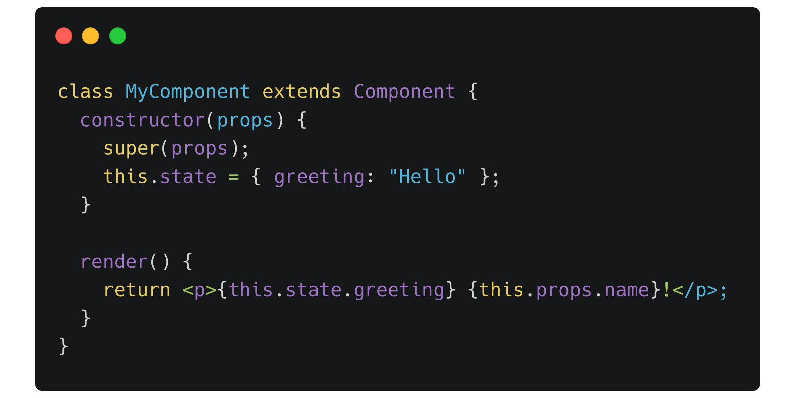
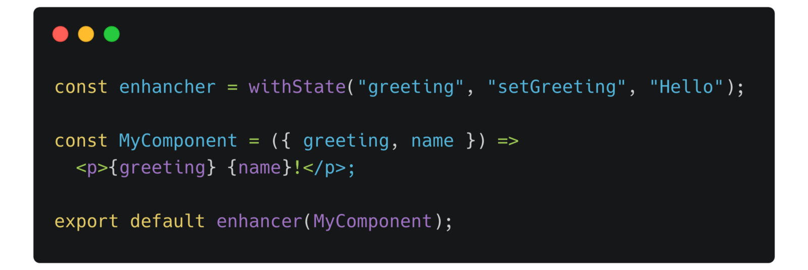
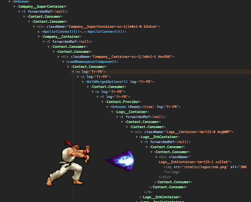
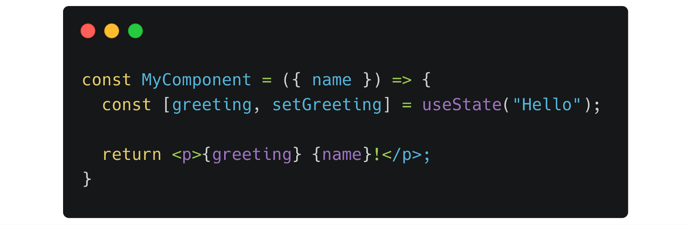
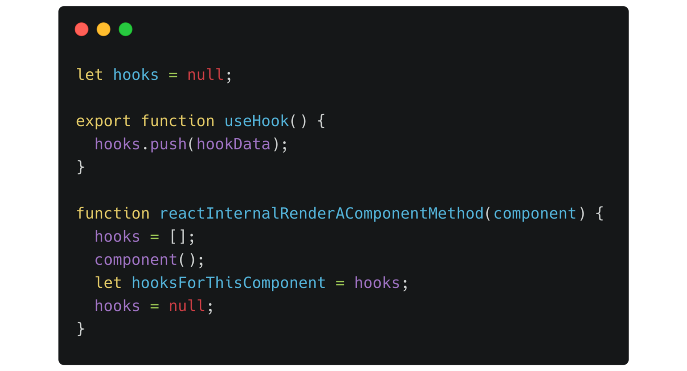

How to write an article about React Hooks when so many has already been published? This is the question I asked myself before starting this one. I almost abandoned the idea then finally found a bunch of good reasons to continue:

- Firstly, if you don’t write something someone could have already written, you never write anything.
- I intend to start a series following my own journey using hooks on an existing project, so I need an entry point.
- By being a bit hype driven by nature, using Recompose (see below) for a long time, looked at React Fiber under the hood and having the opportunity to test hooks in early stage, I may have some interesting insights about this new feature.

So I will simply start this article considering you know the basics about React but nothing about hooks.

## React state of the art before hooks

There are two major ways of creating a React component: by creating a class or a function.

The function component is more fashionable because it’s shorter and fits well in a community in love with functional programming. To go further, it’s the direct application of the React concept saying that a component is a direct transformation of input properties into markup.

But before hooks, functional components were really limited. No state, no lifecycle, you were able to use those components only for really simple use cases.

To have full control, you had to convert your component to the class version.

I don’t want to enter the never-ending "functions versus classes" debate, let’s just say that switching from one to the other each time you need a state variable was painful (unless you’ve got some fancy features in your editor as in Webstorm).

## Higher-order Components (HoC)

A pattern has emerged in the React community. It is now very common and has surprisingly no equivalent in other frameworks: HoC.

Basically, it consists in a function which takes a component in argument and returns a new component wrapping your component and passing props allowing you to use specific features.

This pattern has quickly spread and there are multiple open-source libraries that mainly rely on HoC to get access to the Redux store, inject GraphQL data, get i18n translation, and so on.

This pattern has a lot of benefits:

- Your own components can stay simple, most often, they can be functional component.
- Each feature your component uses can be easily identified. It can even be shared between several components.

Those who liked this pattern the most has even imagined to do everything with HoC. There is a de facto library dedicated to this concept which is called Recompose. Recompose offers a whole bunch of basic HoC to use every aspect of React, you just have to compose your HoC with each feature you need.

I was a big fan of Recompose, I built whole apps with it, using absolutely no class component at all. It was great for code structure and logic reuse.

But HoC have real drawbacks you have to understand:

- The concept of component encapsulation is not easy to apprehend. I still need a moment of reflection when writing one from scratch.
- Encapsulate 2, 4, sometimes 6 or 8 components around the one you wrote has a performance overhead, it’s a fact. It may not be heavy but it’s true.
- HoC really make your debug panel looks like a mess. It makes me remember the dark days of JavaScript callback hell!

## Hooks!

Wow, finally the main topic! I wanted to explain the context of the usages in the React community in order to understand what problems the hooks try to solve. Now we are ready!

> Hooks let you use state and other React features without writing a class. You can also **build your own Hooks** to share reusable stateful logic between components.

That’s the direct quotation from the [official announcement](https://reactjs.org/blog/2019/02/06/react-v16.8.0.html) of the release of React 16.8.0 which contains hooks (yes, they are already released!)

If I tried my own explanation, I would say there is a new set of simple functions you can use in functional components to access to all React features, just the thing you couldn’t do before.

These functions triggers basic React features and you can use them directly. You also can, [and are encouraged to do it](https://reactjs.org/docs/hooks-custom.html), compose them to make more advanced ones. Or it will be your favorite frameworks which will use them to give you access to their features.

There are 3 basics ones easy to remember:

- `useState` to declare a new state variable for the component
- `useEffect` to interact with the component lifecycle
- `useContext` to get a [context](https://reactjs.org/docs/context.html) value

[The complete API can be find on the official React documentation.](https://reactjs.org/docs/hooks-reference.html)

As I have deeply introduced HoC, you can see hooks as the combination of the good parts of HoC: organizing and sharing component features, without their bad parts: extensive component encapsulation.

To me, as a user of Recompose, hooks have turned one of my favorite library completely useless but what better end a library could have other than the generalization of the concept directly in the framework it was trying to fill the blank?

For those who are concerned about Recompose itself, you have to know that the creator [Andrew Clark](https://twitter.com/acdlite) is now in the React core team, he worked himself on coding the hooks and [officially stated that it is destined to be abandoned](https://github.com/acdlite/recompose#a-note-from-the-author-acdlite-oct-25-2018). Big up to him!

What is not said at this point is that hooks are fully retro-compatible. Classes components still works as before, HoC still works the same too. The React core team even doesn’t advise developers to aggressively convert their codebases (exactly what I will not do 😇) but rather advise to get used to it on a few new components before considering to refactor the old ones.

## Why is it so exciting?

If you are a JavaScript Web developer like me, perhaps you already think of all the benefits you can get from this new feature and why it is a really important one and not just a new gadget among others.

Yet I think that it’s a good exercice to sum them up. Let’s imagine what a React world full of hooks would look like (I’m pretty sure the community will tend to widely adopt them):

- The end of the segmentation between functional and class components, at least in the same project. Functional and class components becomes a personal style choice just like space versus tab indentation or trailing comma…
- Abandon of HoC to save complexity, performance overhead and debug obfuscation.
- If there is no more class, there is no more `this` 🎉.
- **As component logic is just function calls now, it can be extracted in other files, shared, reused and tested way better than before.**

This last point is by far the most important. It’s something I already tasted (yes, with an “a”) through an intensive use of Recompose. I have no word to tell you how amazing it is and I’m very pleased to see that I can now implement the same thing out-of-the-box using React itself!

## How it works (roughly)

From the user’s point of view, you just call `use**` functions from your functional component and that’s all. But how can it be possible or even performant when you know that this component function will be called for each change detection?

[It’s at this point that you discover that there are rules to use hooks.](https://reactjs.org/docs/hooks-rules.html)

> Hooks are not standard functions.

In a nutshell: you can only call hooks from functional components and you have to always use the same amount of hooks and in the same order at each execution (so you don’t put hooks in a condition or a loop).

It makes sense looking at the hook implementation in pseudo code.

So each hook function get back to the running instance of React in a shared array. React is in control of calling your component so it knows perfectly from which component you used the hook.

The hooks array allows React to match a previous call to the next one of the same hook and that explains why there is a rule about the amount and the order. This implementation can be (and has been) discussed but the React core team concluded that this is the best choice considering several solutions as Dan Abramov explained it well.

More globally, as hooks can’t be called from anywhere, in any order, anytime etc.:

> Hooks are not a safe pattern by design.

That’s a sacrifice the React team has made allowing a very simple API for the vast majority.

About performance, we add code in the render function which is called many times. It can have a cost and we have the responsibility as React developers to not do intensive computation in these functions.

Yet, we should only call a bunch of hooks from these functions and we are not supposed to do a lot more. On the opposite, we gain the overhead of not defining and instantiating a whole class which could me more important.

Finally, when performance really matters, several hooks have memoization options which allow the developer to precisely define when to run code.

## Let’s write some hooks!

It was quite a long article yet we barely brushed the subject. Using hooks (and only hooks) in a whole application raises a lot more questions.

That’s why this is only the first, a bit theoretical, article on the subject. I planned to write another ones during my own process of switching to hooks.

As a modest cliffhanger, here is what I planned to address in the next articles:

- Hooks in third party frameworks (in early 2019)
- Examples of logic sharing between components
- Comparison between Recompose and hooks
- Hooks and SSR with Next
- Testing custom hooks and components with hooks

> Thanks to Nicolas Cuillery for the review
