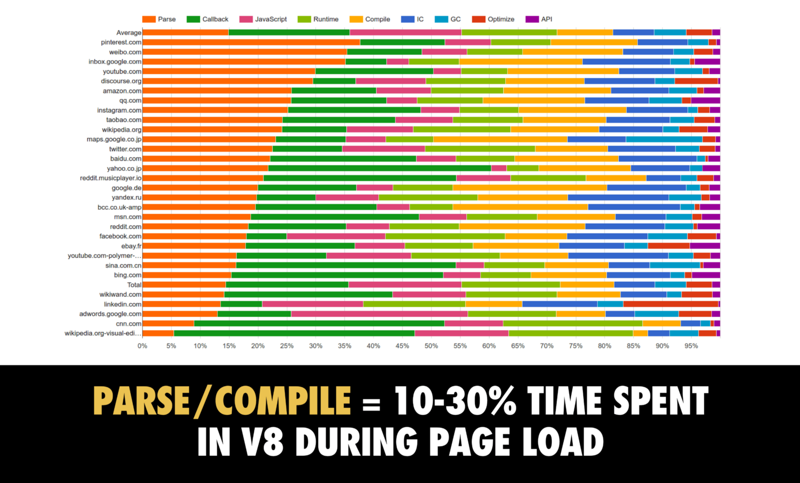
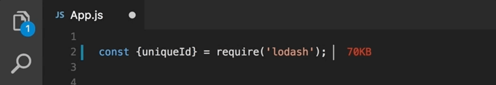
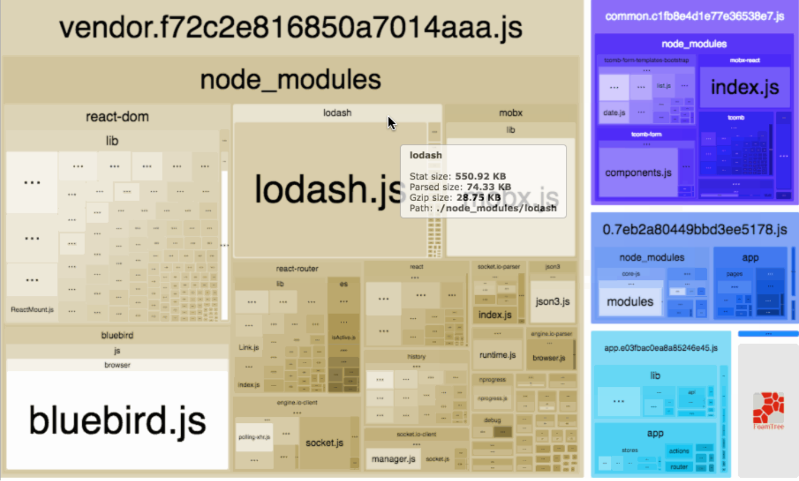

There are two primary measures for JS performance. The first one, which is attracting all the attention, is DOM updating which is almost maxed out by modern frameworks. It also really depends on the application code and often not a real deal for your application (who cares about milliseconds of rendering performances when your back-end spent 2s gathering your data?).

For the second one, frameworks often don't even communicate real figures, they hide themselves behind features supposed to resolve the question like SSR, Tree Shaking or Lazy Loading. Yet, in many cases, it's a considerably more important performance issue than any other in your JS app.

> It is the weight of your JavaScript code.

Never lose sight of the fact that even if we see today's websites as fully featured apps, the Web is still a platform where the whole app is downloaded, compiled and booted when you open a tab. Imagine that for Outlook, Word or Photoshop!

A webapp loading starts with the network bandwidth to download the file then the CPU to uncompress and compile it. The more code you got the most your app will need bandwith and CPU. Even then, more code will eventually mean a slower app. Look at this tweet from Nintendo.

<blockquote class="twitter-tweet" data-lang="en">
Switch OS UI Session: in cutting player&#39;s wait time as much as possible, Switch&#39;s home menu design resources have less than 200KB. amazing. <a href="https://t.co/gnINFXnFPp">https://t.co/gnINFXnFPp</a>
&mdash; Takashi Mochizuki (@mochi_wsj) <a href="https://twitter.com/mochi_wsj/status/1032276091279302656?ref_src=twsrc%5Etfw">August 22, 2018</a></blockquote>

They have almost no network consideration to deal with (as far as I know) yet they care deeply about their app size for performances and fluidity.

Lastly: "less code is less bug". I always loved this quote. Shipping less code (both yours and third parties') will always be better for stability.

## Tools don't solve everything

A good part of the so rich Web tooling we use nowadays is about limiting the size of your JS. All of these techniques are optimizations which are great and I recommend to use almost all of them. Yet, optimizations are not solutions and the real amount of JS is still a question.

### Bundling

The first tool we use when tackling JS performance is bundling. We don't serve the browser as many files as we develop knowing that every request to the server has its cost. Most of the time, we compile a bundle of one, two to five bundled JS file. Yet, you still have as much code as before.

### Minifying

For a long time, we've been using JS minification, which means modifying the code by removing most of white spaces and line breaks as well as renaming variables to shorter names in order to have almost the same code but with less characters and then, get a smaller weight. It's great and it has almost no downside except readability and then debuggability which can be handled with source maps.

Minification will reduce the weight of your JS from 50% to 90%! (if you have lots of comments 😀)

<iframe width="800" height="450" src="//embed.chartblocks.com/1.0/?c=5ce570fc3ba0f6d07e63d2c9&t=a95c1edce5b7d21" frameBorder="0"></iframe>

### Compression

The most magical solution to reduce JS weight is binary compression. Most of the time, you don't even have to configure any tooling, it's your HTTP server which will compress your files with Gzip or Brotli. For best practices about compression, see this great article by [Antoine Caron](https://open-blog.dev/authors/slashgear) [Why you should use Compression Webpack Plugin?](https://open-blog.dev/posts/slashgear/why-you-should-use-compression-webpack-plugin/).

Like the other solutions, compression is great and you should definitely use it. Nevertheless, it doesn't mean that you are free to serve any amount of JS.

First, no matters how great the percentage of reduction the compression offers, it's still a ratio of your original weight: 30% of 10MB is still 3MB…

<iframe width="800" height="450" src="//embed.chartblocks.com/1.0/?c=5ced4a1f3ba0f66a7e57560b&t=95e776621bbc403" frameBorder="0"></iframe>

Second, compression is only a network artifact. The amount of data to carry over the network is reduced but your actual amount of code is still the same. The browser will still have to parse and compile the same amount of code. Even worse, the client will have to decompress the file before being able to use it. These steps could seem unimportant but on an old smartphone, it can be really slow, sometime longer than network time!

Take the example of [6play.fr](https://6play.fr/): 1MB of JS, 100ms compile time on my MacBook and up to 500ms with CPU throttling.

This illustration come from [Addy Osmani](https://addyosmani.com/) and its post [The cost of JavaScript](https://medium.com/@addyosmani/the-cost-of-javascript-in-2018-7d8950fbb5d4). He's an important reference on the subject and producing measures on these type of things can be tricky.

Beware that most frameworks communicate about their size only after binary compression. "Preact: Fast 3kB alternative to React" but with an actual size of 8.7kB before compression (which is still great btw)

### Tree Shaking

Another magic feature to reduce the amount of code is called Tree Shaking. It's the ability in modern JS code to statically analyze imports in your code in order to automatically detect unused parts and remove them.

Frameworks like Angular have deeply invested in Tree Shaking. They've optimized their own source code to import only what's needed. That way they ensure that only the necessary parts of the framework are imported and then, produce the smallest possible bundle.

Tree Shaking is available in almost all bundlers by default now.

### Server Side Rendering

First of all, SSR is the Web frameworks' ability to be executed server side in order to serve a fully computed page in response to the initial request from the client, allowing the user to see something during the JS load time.

I'm a big fan of server side rendering yet today I will point its limitations.

SSR will reduce what we call the Time To First Paint (TTFP). The time between the initial request from the user and the moment when the user actually sees something. It's especially important for content websites and almost mandatory for SEO (most crawlers will not execute JS). Still, when TTFP occurs, you don't have any JS loaded and your page is not interactive.

After the JS is loaded, the framework will start over, "hydrate" the existing markup and then being able to handle user events. We call this, Time To Interactive (TTI).

In some ways, SSR could even be counterproductive. Mainly because running the framework server side use time and resources when returning static resources is faster. Also because most frameworks, to be able to "hydrate", need an export of the context used server side which can represent some weight too.

### Lazy Loading

In the early days of Single Page Applications (SPA), we were used to bundle all our JS code. Which meant that as soon as we were requesting a webapp, we were sending all the source code the app would ever need before doing anything. That was bad and fortunately, frameworks and tooling evolved to manage JS code lazy loading with increasing ease.

A well implemented Lazy loading mechanism means that you will only start downloading the code needed to bootstrap your application at the beginning. You will load the rest of your code latter on, when you will be needing it.

Still, if you need a lot of code to run your app, at one point or another, you'll need to load it.

### Compiling vs Runtime

A new approach has appeared recently. By compiling some application code, they can reduce the size of the library left to load. In a compiler the common code used by the compiled code is called the runtime.

Two frameworks illustrate this concept. Angular, since its version 4, proposes to compile template code at build time (the feature is called Ahead Of Time or AOT) to save up to half of its size. The second one is Svelte, the first framework which concept is to have no runtime at all.

Compiling is an interesting strategy but beware of backfire. Compiled code will ultimately be bigger than your source code and at one point, using a runtime could produce a smaller bundle.

### And so on…

There is a lot of tools and strategies to reduce the weight of your JS. I didn't mentioned them all, there are also cache considerations, CDNs and I surely missed a few.

But you understand now that none of these techniques are absolute, you still and always have to care about the weight of the code you ship.

## The weight of things

In order to manage your app dependencies considering their weight, you have to know how much things weigh.

There are popular plugins like [VS Code Import Cost](https://marketplace.visualstudio.com/items?itemName=wix.vscode-import-cost) or [Webpack Bundle Analyzer](https://github.com/webpack-contrib/webpack-bundle-analyzer) to show the weight of each import you do in your code.

They are pretty fancy but beware because the problem is that worrying about weight in your code editor is too late. You have to consider the matter before hand, when you choose your stack.

As explained before, there are different measures commonly used. Mainly before and after compression. To make it simpler, I will use the figures before compression (but after minification) from now on.

### Common frameworks and library

Without larger comments, let see the weight of the most popular libraries commonly used nowadays (sorry if yours isn't there)

- Lodash: 72kB
- jQuery: 86kB
- Backbone: 42kB (including Underscore but will need jQuery too)
- AngularJS: 172kB
- React: 117kB
- Angular: 299kB (bundle of a Hello World app) with AoT, 663kB with JiT
- Vue: 91kB
- Preact: 8kB
- Ember: 733kB (bundle of a Hello World app)
- Leaflet: 138kB
- Bootstrap: 152kB of CSS, 57kB of JS
- Bulma: 186kB of CSS

<iframe width="800" height="450" src="//embed.chartblocks.com/1.0/?c=5d1a0f363ba0f6d81845627b&t=2999c8ac5b1c983" frameBorder="0"></iframe>

### Hello world weight vs real world weight

When it comes to JS Web Frameworks, figures have to be discussed furthermore.

Modern frameworks are deeply modular. As much Angular which considers each module as part of the framework, as React which considers each module as third parties. Yet you often need these modules for your app, so, considering only the core framework weight is a mistake.

It can create an important difference between the weight of an hello world app using only the core module of a framework and a real world app. The extensive use of Tree Shaking recently amplified the problem. The risk is that some framework would communicate on cool numbers with a very simple example using nothing and where Tree Shaking removed literally everything when the true size of the framework has not changed.

<iframe width="800" height="450" src="//embed.chartblocks.com/1.0/?c=5d1a1d2f3ba0f6d71e45627a&t=462bcc52236cd5f" frameBorder="0"></iframe>

To perform these measures, I bundled the apps with the framework, a state management framework, a router and a Material Design component library (with an import all to prevent Tree Shaking). It's not really like "real world" apps it's quite similar.

We see that the initial weight of a framework does not necessarily indicates the final result. Yet, it looks like the Vue figure is mainly due to Vuetify which contains really a lot of components.

### The weight of your code

In any other platform I know of (surely it should exists on hardware development) the size of your own code doesn't really matters. I remember Java applications where there was hundreds of megabytes of dependency jars when my jar was one or two megabytes. It's not a troll about Java, it doesn't really matter in this case.

In frontend JS, you can't think that way. Your dependencies has to be small and your code can really quickly be bigger than your frameworks.

It's not necessarily wrong. Big webapps exist and they need code. But you should be aware that it's an issue and you should use all the techniques explained before to minimize the weight.

For example, I used to work on a big webapp where the vendors was about 350kb (after compression) and the specific code was about the same.

### The weight of other things

Until now, I only talked about weight of the JS files, yet a website is made of contents from several different types. When you take care of the weight of your JS, you also have to consider the whole pictures.

Your website will surely contains also HTML, CSS, images, fonts, videos…

- Outside of special cases, HTML will be very light, yet it's always great to minify it.
- CSS could weights a few hundred kB to more than a MB. So it has to be considered. Dead code elimination, lazy loading, minification, all of theses techniques can be applied to CSS too.
- Images will often be the heaviest things to load on your website. They have frequently been used as an excuse to avoid taking care of the weight of JS files because "it's only a little percentage of the whole page". Images are a really important matter of your page weight. You have to carefully optimize it, download the smallest version possible, lazy load some and sometimes just remove some others. If images are handled carefully, they can weigh less than your JS.
- Fonts are a content type often ignored in web page optimization but they are super heavy and they are a rendering bottleneck to display something on the page.
- Videos are a really specific content type. It weighs a lot but are often not auto started, really well compressed (except gifs 😂) and are streamed most of the time so in these cases, it does not impact the website load time directly.

According to [HTTP Archive State of the Web](https://httparchive.org/reports/state-of-the-web), the average website weigh today is 1.8MB on desktop and 1.6MB on mobile. The share of JS in that weight is 22% or about 400kB (on the wire).

### Conclusion

The Web is a platform where no matter what you do, the weight of your code matter. We have an ecosystem full of great tools to optimize it yet there is no silver bullet and at one point or another, you will have to pay the price.

It brings the comunity to push forwards with new frameworks, new features without adding more line of codes sometimes even less (VueJS is smaller than AngularJS).

It has a very cool symbolic where each line of code is precious, highly well crafted and the comunity has to evolve with pure new ideas and never just stacking up new code over old one.

All the figures in this post are computed from this GitHub repository: [https://github.com/swiip/weight-of-js](https://github.com/swiip/weight-of-js)
