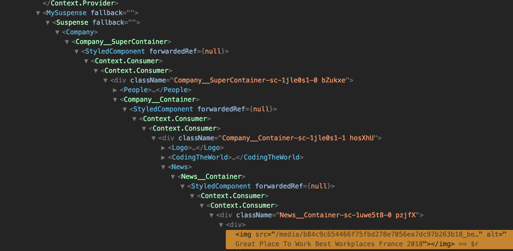

This is the follow-up of my first post [React Hooks, my introduction](https://open-blog.dev/posts/swiip/react-hooks-my-introduction/). If you don’t know what hooks are or just want to start from the beginning please check this article first.

As promised, I have now used hooks on a PoC project: [pokemon-arena](https://github.com/Swiip/pokemon-arena) and one in production: the [zenika.com](https://www.zenika.com/) website (not open source, sorry, perhaps one day…). I don’t have a lot of feedbacks about the PoC but using hooks on a real project has opened new questions.

This post is the feedback of my experience with hooks regarding some developer perspectives such as: code-reuse, 3rd-party librairies and testing.

A last reminder about the fact that no one in the React team nor me is advising you to refactor your whole codebase like I did. It’s just a new opt-in feature you can use if you want. I made the switch aggressively out of curiosity not because I needed it.

## Code reuse

One of the major benefits provided by hooks is the ability to reuse code. As a user of [Recompose](https://github.com/acdlite/recompose), I was already able to reuse code as custom HoC. That was one of the most important reason I used it in the first place. Switching to hooks first allowed me to remove the library on itself then to convert all of my custom HoCs to custom hooks. It was pretty straightforward as I could replace them one for one with the same semantic.

Not a huge code reduction then but I was happy to see that I could keep the benefits while removing a library.

Let’s see an example of component logic sharing. In zenika.com, there is a list of our agencies coming from a [GraphQL](https://graphql.org/) request. I have a bit of logic (with [Redux](https://redux.js.org/)) to shuffle the list not to present the same order every time (and make no one jealous 😂). But I use this list in two places on the website.

There is a few requirement for this feature. Load data only once for several uses, shuffle once to avoid having different results at each rendering (avoiding inconsistent rendering). And simply don’t forget to use the shuffled list everytime (I mention it as I had the bug).

It quickly made sense to extract a custom hook gathering the logic of fetching data, launching the shuffle, then returning the list. With a custom hook, there is a lot of benefits :

- Other developers only have to think of using that hook to get the agencies list. They can forget about the shuffle logic.
- Two different components will always use the same logic to access agencies list and can’t behave differently.
- It’s great for testing and isolation of concern. The hook will be able to be tested isolated from any component checking only for the logic of fetching agencies. The components can suppose that the agencies from the hook is good and focus on their own logic about displaying them.

```javascript
import { useQuery } from "react-apollo-hooks"
import { gql } from "apollo-boost"

import { initAgencies, selectAgency } from "../agencies"
import useRedux from "./useRedux"
import useLoaded from "./useLoaded"

const agencyQuery = gql`
  query Agencies { ... }
`

const useAgencies = () => {
  const query = useQuery(agencyQuery)

  const {
    agencies,
    selectedAgency,
    dispatchInitAgencies,
    dispatchSelectAgency,
  } = useRedux(
    state => ({
      agencies: state.agencies.agencies,
      selectedAgency: state.agencies.selectedAgency,
    }),
    dispatch => ({
      dispatchInitAgencies: () => dispatch(initAgencies(query.data.agencies)),
      dispatchSelectAgency: agency => dispatch(selectAgency(agency)),
    }),
    [query.data.agencies]
  )

  useLoaded(query, () => dispatchInitAgencies())

  return { agencies, selectedAgency, selectAgency: dispatchSelectAgency }
}

export default useAgencies
```

We can also imagine guidelines in a project (even if I didn’t go that far) where the direct use of a data related hook like mine for GraphQL is prohibited in the components in profit of always using a custom hook. In that case, we would be able to fully isolate the data layer and to add logic like my shuffle or even changing the data framework without touching the components.

## Third parties

With my own experience of switching from HoCs to hooks most of the time passed was not about converting lots of code to the new API but in finding and configuring new third party libraries.

I allow myself a bit of a digression. That’s typical in many structural evolutions. We estimate not enough time to deal with new libraries and too much about simple refactorings. But that’s another topic.

Let’s put some context. Zenika.com is a corporate website with not a lot of logic but has to deal with SSR, content and i18n. The main libraries I used besides React are: [Next](https://nextjs.org/), [Apollo](https://www.apollographql.com/), [Redux](https://redux.js.org/) and [i18next](https://www.i18next.com/). You don’t necessarily use the same ones but they covers most typical cases.


> Next doesn’t provide support for hooks yet.

That sentence doesn’t have any real sense but I kept it knowingly to open the question of the meaning of supporting hooks. Hooks are just a new opt-in API so any existing framework or library is compatible. A library which supports hooks would only be a library which offers some custom hooks to use its feature.

Next is more a framework and has a small API which can be proposed as hooks. The principal one is the router which has to be accessed through a HoC `withRouter` and where we would like to have also a `useRouter`. The lead developer of Next [already teased it on twitter](https://twitter.com/timneutkens/status/1057053195044823040), also, there should be a way to add it manually.

But I chose to kept it as an example of cohabitation. I still use the official `withRouter` with no problem in a middle of an app which now exclusively uses hooks and almost any other HoC.

I asked myself another question about removing HoCs with Next but it’s a side question which I will only brush here. To configure frameworks like Apollo or Redux in Next, there is the use of HoCs on the `_app.js` component. I tried to remove those HoCs for some kind of “no HoC extremism” and failed. Indeed, these HoCs are more complicated as they have to handle server side and browser side. This is just a reminder that HoC are still an interesting concept which could keep some value even with hooks.


If you don’t know anything about i18next, it’s a i18n library (as indicated by its name) not bound to React, I use the official wrapper [react-i18next](https://react.i18next.com/).

In that case, react-i18next already published a major version containing a hook API when I started my work. That was pretty amazing, not much libraries reflect frameworks evolutions as quickly.

Hooks migration basically took the shape of a library update with its lot of breaking changes. But basically, switching from the HoC `withNamespace` to the Hook `useTranslation` was quite easy.


I coupled these two libraries not because they are alike in any way but because my journey for using them with hooks was very similar. In both cases, the official library didn’t support hooks yet ([react-apollo](https://github.com/apollographql/react-apollo) and [react-redux](https://github.com/reduxjs/react-redux)) intends to (for [Apollo](https://github.com/apollographql/react-apollo/issues/2539) and for [Redux](https://github.com/reduxjs/react-redux/issues/1179)) but there is alternative implementations which already exists ([react-apollo-hooks](https://github.com/trojanowski/react-apollo-hooks) and [react-redux-hooks](https://github.com/facebookincubator/redux-react-hook)).

I found both alternate libraries quite stable already and was able to use their hooks pretty quickly. In both cases, I mostly struggled with their Next wrapper which is not directly related to hooks. Once the wrapper worked server side, client side and handled the hidration (mechanism of restarting React on an existing markup), the rest went smoothly.

The only question left was about the hook API. The one from react-redux-hook has (at least at this moment) a really low level API forcing you to handle callback memoization by yourself each time. I was able to produce a wrapper more suited to what I wanted very quickly. [We submitted a PR with a friend](https://github.com/facebookincubator/redux-react-hook/pull/37) which will not be merged as is but the API should evolve soon.

## Memoization

In my experience of using hooks, there was only one pain point worth to mention deeper. It’s about memoization. You have to understand that writing your logic inside the render method is cool but you can’t fully forget that it’s a function which will be called at every render of React and there can be a lot.

To avoid running some code too often, the entry point is the [`useMemo`](https://reactjs.org/docs/hooks-reference.html#usememo) hook. It takes a function as first argument and an array as second. The array is the list of dependencies of the function. React will check by reference each of them and call the function only when there is a difference. The return value of the hook will be the return value of the function in first argument. (For the [Vue](https://fr.vuejs.org/index.html) developers, `useMemo` looks a lot like a `computed` property)

This way, you can control precisely when some code will be run or not and save some calculations but the pattern on itself is used in several other hooks. The second to mention is `useCallback` which is basically the same as `useMemo` for functions. But the most important to mention is useEffect.

If you’re like me, you’ll suppose `useEffect` is like `componentDidMount` and you will be surprised to see that it’s ran way more than once. It’s in fact more the equivalent of `componentDidUpdate`. By default, it’s ran for each change in the components and it’s often not what you want. `useEffect` takes an array as second argument which is the same semantic as `useMemo` and will allow you to control when the callback will be ran.

It works pretty well but to be honest, having to care about when each code is ran considering each reference I passed in lists in second argument can be boring and error prone. I ended up many times putting a log in my `useEffect` to check if it was called when I wanted and no more.

## Testing

There is a topic about hooks where I’ve seen everything and its opposite, it’s about testing. In my project, I updated all my tests and there is what I found.

First, there is the separation of concern. Being able to extract logic code from components and localize it in a dedicated file is, by essence, great for testing. Testing a custom hook is quite easy, not much to say, you don’t have component or rendering to manage, you just have to check the logic of the hook. It’s easier than testing HoC as you don’t have to handle a dumb component to wrap.

During a moment when hooks was just released, it was said that it was not working in tests. In fact there was a bug in [Enzyme](https://airbnb.io/enzyme/) that lots of people are using but it has been quickly fixed. There is still no direct support with utility functions for hooks but at least you can test a component with hooks as any other.

I think, there is two major ways to test a component with hooks.

- The way with a real mount: no mocking of hooks and interact with the component in a way which triggers hooks and tests the result.
- The other way is to [shallow the rendering](https://airbnb.io/enzyme/docs/api/shallow.html) but in this case, at least today with Enzyme, you have to mock all hooks. It could seem to be difficult but mocking hooks is quite easy.

Shallow rendering and mocking hooks is the way I chose and I was pretty happy with it. Mocking all hooks allows me to perfectly isolate my components and each frameworks like Apollo or Redux considering my components are in charge of only rendering data and hooks are in charge of behaving as they should.

```javascript
import React from "react"
import { shallow } from "enzyme"
import Router from "next/router"

import AgenciesMenu from "../AgenciesMenu"
import { setAgencies, selectAgency } from "../../../logic/hooks/useAgencies"

const lyon = { slug: "lyon" }
const paris = { slug: "paris" }
const agencies = [lyon, paris]

jest.mock("../../../logic/hooks/useAgencies")

test("should match snapshot", () => {
  setAgencies(agencies)
  const cmp = shallow(<AgenciesMenu />)
  expect(cmp).toMatchSnapshot()
})

test("should provide a select agency handler which call the action and route", () => {
  setAgencies(agencies)

  const cmp = shallow(<AgenciesMenu />)
  const handleAgency = cmp
    .find("AgenciesMenu__Item")
    .first()
    .prop("onClick")

  handleAgency()

  expect(selectAgency).toHaveBeenCalled()
  expect(Router.push).toHaveBeenCalled()
})
```

## Other remarks

Using hooks, I made several other smaller remarks

- Heavy usage of HoCs blurs a lot what props your component is receiving or not. Props jump from one HoC to the next and you often end up with arguments in your functional components which are totally different of the one really needed in input. Hooks restore real props in your function declaration which helps readability.
- One goal of removing HoCs was about to simplify the component tree of React. To be honest, it’s better but not so much. Mainly because I use [styled-components](https://www.styled-components.com/),“ok”, but not only. There is a lot of components in a React app and each use of a context adds a layer and to be honest, it’s still not really readable with hooks.



- Small pain but real pain. Switching from a real dumb functional component to a one with hooks asks you to add a function body (adding braces) and a return statement for the markup which is a pain to change in every single file.
- I surely spent more time about updating libraries which use other new APIs of React than hooks. I think mostly of [`Suspense`](https://reactjs.org/docs/code-splitting.html#suspense) and the [new context API](https://reactjs.org/docs/context.html). It’s just that these new libraries versions which offers hooks are more recent and use “also” the last features.
- Perhaps you see this coming before but I didn’t use a lots of native React hooks. Some `useEffect` and some `useState`. But in the end, the hooks I used the most are `useRedux`, `useQuery` (Apollo) and `useTranslations` (i18next).

## Conclusion

I’m still fan of hooks. It didn’t profoundly change my code because I anticipated the move through HoCs. But now, I can profit of the code reuse of sharing component logic as a part of the framework and not some trick I’m using and others doesn’t understand.


As you would expect, it’s still fresh, several libraries are not ready yet and others are still in transition. But I’m pretty convinced that hooks are here for long and will progressively become standard in the React community.

> Thanks to Nicolas Cuillery, Jérémie Picard, Marvin Frachet, and Mouss.
