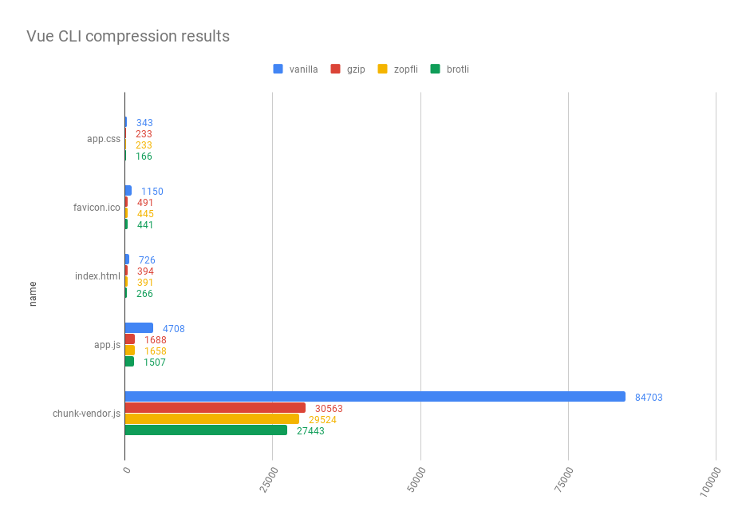

# Why you should use Compression Webpack Plugin ?

If you are using webpack as module bundler for your application, you probably are concerned by its own performance and loading time.
You may have used code splitting, tree shaking, uglifyfication but you may have forgot a very important step.

## Compression is mandatory

In 2019, if you are not using a compression algorithm to deliver your files in a lighter version to make your website load faster, the situation is critical.
Every website performance analyser will tell you to do it. Here is a size comparison of a vanilla [Vue CLI](https://cli.vuejs.org/) website with and without Gzip.


**Here we reduce 64% of the actual size with Gzip.**

## Compressing static files on the fly is redondant

Every modern web server has the possibility to compress files on demand.
Although Gzip is fast, compressing static files on each demand is anti-pattern.
Even if you use a cache in front of your static files requests.

**Static files compression should be done during the build time.**

If you are in a webpack context, adding compression is very easy.

To do so, you can install the _compression-webpack-plugin_ with:

```bash
npm install --dev compression-webpack-plugin
```

…and add it in your production configuration:

```js
...
plugins: [
    new CompressionWebpackPlugin(),
]
...
```

In two easy steps, your output static files will have their *.gz* equivalent.
Now if you ship those files on a webserver like [Caddy](https://caddyserver.com/).
It will automatically deliver the pre-gzipped version if they exist.
However you need to activate it [in Nginx server configuration](http://nginx.org/en/docs/http/ngx_http_gzip_static_module.html).

## "Should we only generate .gz ?"

If you followed the above steps, you enabled compression on your webserver. That is great!

**But in 2019, Gzip is not the only solution to compress your files.**

### Zopfli

Zopfli is a lossless compression algorithm which has better compression results compared to Gzip with slower compression time.
So if you can, you must always use Zopfli compression for static files, instead of basic Gzip.
Output files of Zopfli respects the same format as Gzip, browser support is the same.

You can use zopfli [with compression webpack plugin.](https://github.com/webpack-contrib/compression-webpack-plugin#using-zopfli)

### Brotli

Brotli is a recent compression algorithm ([RFC 7932](https://tools.ietf.org/html/rfc7932)) with [a great browser support](https://caniuse.com/#search=brotli).
Based on a new context modeling and a new file format, brotli is very performant for compressing static files.
There is still some difficult parts with brotli (not available on Node < v11, hard to configure on some webservers like Nginx)

You can use brotli [with compression webpack plugin.](https://github.com/webpack-contrib/compression-webpack-plugin#using-zopfli)



## In conclusion: "Why doing it with Webpack ?"

Compressing static files during the build steps is still a moot topic.
Some people argue that it is up to the web server to compress the files.
In fact, today web servers do not really optimize the compression of static files.

When you compress during the build :

- You can easily see the complete size of your web application (which is great when you want to track web app performances)
- Your app is much more portable (you will easily change your deployment or your web server with pre-compressed assets)
- As a frontend developper you are familiar with the great value of lossless compression.

<hr />

<Author />
<LastTenPosts />
